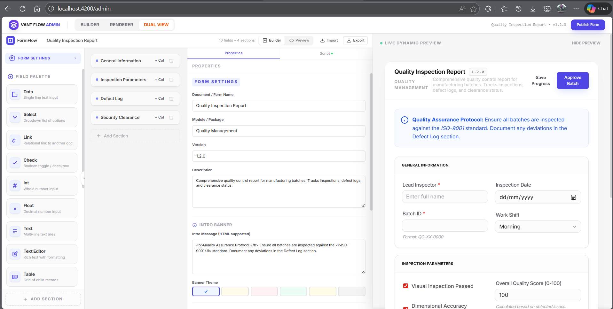
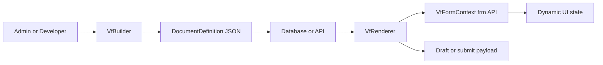

# Vant Flow

Vant Flow is an Angular form platform for teams that need more than static JSON forms.

It combines:

- a visual builder for authoring `DocumentDefinition` schemas
- a runtime renderer for executing those schemas as live forms
- a sandboxed `frm` scripting API for dynamic business logic
- rich field support for tables, attachments, signatures, editors, and stepper flows
- optional AI and MCP tooling for scaffold and assistant workflows

The core idea is simple: ship the form engine once, then evolve forms from data instead of rebuilding screens for every workflow change.



## Why this project exists

Most internal business apps eventually hit the same wall:

- the form layout changes often
- validation rules change often
- visibility and required logic depend on role, status, or policy
- one workflow turns into ten similar workflows

Vant Flow is built for that kind of software. Instead of hardcoding every form page, you define the structure in JSON and let the renderer execute the document at runtime.

That gives teams a practical split:

- schema controls layout, defaults, rules, actions, and field configuration
- client scripts control dynamic behavior through a constrained `frm` API
- the host app still owns auth, storage, APIs, uploads, and surrounding product logic

## What it can do

- Build forms visually with `VfBuilder`
- Render the same schema in production with `VfRenderer`
- Support flat forms or multi-step stepper flows
- Run client-side business logic with `frm.on(...)`, `frm.set_value(...)`, `frm.set_df_property(...)`, and more
- Handle nested business payloads with `data_group`
- Support rich fields like `Attach`, `Signature`, `Text Editor`, `Table`, and `Link`
- Inject runtime host metadata into scripts through `[metadata]`
- Connect `Link` fields to remote autocomplete endpoints
- Plug attachments and signatures into app-owned upload/storage pipelines
- Reuse the same schema in admin, preview, user, and readonly audit experiences

## How the platform fits together



In this repo, that architecture is demonstrated in three layers:

- `projects/vant-flow`: the reusable Angular library
- `examples/kai-ng-flow`: a reference app with admin, preview, user, and submission history flows
- `projects/vant-mcp`: MCP tooling for AI-assisted schema generation and validation workflows

## Quick start

### Install

```bash
npm install vant-flow
```

### Register the provider

```ts
import { ApplicationConfig } from '@angular/core';
import { provideVfFlow } from 'vant-flow';

export const appConfig: ApplicationConfig = {
  providers: [
    provideVfFlow()
  ]
};
```

### Render a schema

```html
<vf-renderer
  [document]="document"
  [initialData]="initialData"
  [metadata]="metadata"
  (formSubmit)="handleSubmit($event)"
></vf-renderer>
```

### Open the visual builder

```html
<vf-builder
  [initialSchema]="document"
  [previewMetadata]="previewMetadata"
  (schemaChange)="onSchemaChange($event)"
></vf-builder>
```

## A minimal client script

Client scripts are authored on the schema and executed through `VfFormContext`.

```js
frm.on('refresh', (_val, frm) => {
  frm.set_intro('Inspection workflow loaded', 'blue');
});

frm.on('status', (value, frm) => {
  if (value === 'Approved') {
    frm.set_df_property('batch_id', 'read_only', true);
    frm.set_df_property('batch_id', 'reqd', true);
  }
});
```

The runtime is intentionally constrained. Scripts can shape the form, but dangerous browser globals are not meant to be available inside the sandbox. Backend work should flow through `frm.call(...)` or host-provided integrations.

## Feature highlights

### 1. Builder plus renderer from one schema

The same `DocumentDefinition` can be:

- designed in the builder
- previewed beside the builder
- rendered for end users
- replayed later in readonly mode

### 2. Dynamic logic without redeploying the UI

Vant Flow supports two layers of runtime behavior:

- declarative rules such as `depends_on` and `mandatory_depends_on`
- scripted rules through the `frm` API

This is the main leverage point of the project: teams can change behavior by updating schema and scripts instead of shipping new page components every time a workflow changes.

### 3. Rich business fields

The library already supports high-value operational patterns:

- line-item tables
- signatures
- attachments
- rich text
- stepper onboarding flows
- remote lookup fields

### 4. Host-controlled integrations

The renderer stays host-agnostic on purpose. Your application controls:

- where schemas are stored
- how submissions are persisted
- what metadata is injected
- how uploads are handled
- how remote link lookups are fetched
- what backend methods `frm.call(...)` invokes

## Important runtime capabilities

### `Link` fields

`Link` fields behave like remote autocomplete lookups and store the full selected object, not just an ID.

```json
{
  "fieldname": "item",
  "fieldtype": "Link",
  "label": "Item",
  "link_config": {
    "data_source": "/api/items/search",
    "mapping": {
      "id": "id",
      "title": "item_name",
      "description": "item_description"
    },
    "filters": {
      "category": "Voucher"
    },
    "method": "GET",
    "cache": true
  }
}
```

Useful script hooks:

- `frm.set_filter(fieldname, filters)`
- `frm.refresh_link(fieldname)`

Use `[linkDataSource]` when your app needs custom auth, transport, or caching behavior.

### Runtime metadata injection

You can pass host-only runtime context into scripts through `[metadata]`.

```html
<vf-renderer
  [document]="invoiceSchema"
  [metadata]="{
    currentUser: { name: 'Alice', role: 'Manager' },
    maxTransactionLimit: 5000
  }"
></vf-renderer>
```

Inside scripts, that becomes `frm.metadata`.

This is separate from persisted `DocumentDefinition.metadata`.

### Media handler pipeline

`Attach` and `Signature` fields can use a renderer-level `mediaHandler`, letting your app upload files and return compact storage references instead of keeping large payloads in form state.

This is especially useful for:

- object storage
- CDN-backed media
- signed download URLs
- existing file services

## AI and MCP support

The example app demonstrates two AI-assisted workflows:

- admin-side prompt-to-schema generation
- user-side assistant-driven form filling

The repo also includes `projects/vant-mcp`, which exposes Vant Flow concepts through MCP tooling so agents can scaffold and manipulate forms in a structured way.

If you want to explore the AI-facing architecture, start here:

- [Architecture Overview](data/docs/architecture-overview.md)
- [MCP Architecture](data/docs/mcp-architecture.md)
- [Example Showcase Architecture](data/docs/example-showcase-architecture.md)

## Try the showcase app locally

### Workspace setup

```bash
git clone https://github.com/DonnC/vant-flow.git
cd vant-flow
npm install
```

### Run the main demo

For the common local workflow, start with the concurrent dev script:

```bash
npm run dev
```

That will:

- build the library once before boot
- keep the library rebuilding in watch mode
- run the Angular showcase app in the same terminal

### Run with the demo proxy

```bash
npm run dev:proxy
```

Use this when you want the example upload and AI proxy flow without opening a second terminal.

### Run the full local stack

```bash
npm run dev:full
```

This starts:

- the library watch build
- the Angular showcase app
- the example proxy
- the MCP server in SSE mode

### Run only the app

```bash
npm start
```

### Build the library

```bash
npm run build
```

### Run tests

```bash
npm test
```

### Run MCP tooling

```bash
npm run build:mcp
npm run mcp
```

If you want live AI providers in the example app, copy `.env.example` to `.env` and provide the relevant keys. The demo supports both OpenAI and Gemini-based flows.

## Best places to start in this repo

- [Root docs index](data/docs/README.md)
- [Architecture overview](data/docs/architecture-overview.md)
- [Builder architecture](data/docs/builder-architecture.md)
- [Renderer architecture](data/docs/renderer-architecture.md)
- [Example showcase architecture](data/docs/example-showcase-architecture.md)
- [Business use cases](data/docs/business-use-cases.md)

Useful sample schemas:

- [README and video showcase: field service work order](data/examples/example-readme-field-service-work-order.json)
- [Field service work order](data/examples/field-service-work-order.json)
- [Stepper onboarding](data/examples/example-stepper-onboarding.json)
- [Inspection report](data/examples/inspection-report.json)
- [Signature and attachment demo](data/examples/example-signature-attach.json)

## Repository structure

- `projects/vant-flow`: Angular library source
- `projects/vant-mcp`: MCP server and tool logic
- `examples/kai-ng-flow`: reference application
- `data/docs`: architecture and product notes
- `data/examples`: importable sample schemas
- `data/screenshots`: README/demo assets

## Who this is a strong fit for

Vant Flow is especially useful when you are building:

- onboarding and KYC flows
- inspections and audits
- field service work orders
- claims and compliance documents
- internal approvals and operational requests
- role-aware forms that change often

## Inspiration

This project is heavily inspired by the ideas and ergonomics of the Frappe ecosystem, but implemented here as a focused Angular-first form platform with its own runtime, builder, and AI/MCP integration direction.
