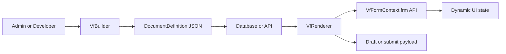

# Vant Flow

Vant Flow is an Angular form platform for teams that need more than static JSON forms.

It combines:

- a visual builder for authoring `DocumentDefinition` schemas
- a runtime renderer for executing those schemas as live forms
- a sandboxed `frm` scripting API for dynamic business logic
- rich field support for tables, attachments, signatures, editors, and stepper flows
- optional AI and MCP tooling for scaffold and assistant workflows

The core idea is simple: ship the form engine once, then evolve forms from data instead of rebuilding screens for every workflow change.


## Why this project exists

Most internal business apps eventually hit the same wall:

- the form layout changes often
- validation rules change often
- visibility and required logic depend on role, status, or policy
- one workflow turns into ten similar workflows

Vant Flow is built for that kind of software. Instead of hardcoding every form page, you define the structure in JSON and let the renderer execute the document at runtime.

That gives teams a practical split:

- schema controls layout, defaults, rules, actions, and field configuration
- client scripts control dynamic behavior through a constrained `frm` API
- the host app still owns auth, storage, APIs, uploads, and surrounding product logic

## What it can do

- Build forms visually with `VfBuilder`
- Render the same schema in production with `VfRenderer`
- Support flat forms or multi-step stepper flows
- Run client-side business logic with `frm.on(...)`, `frm.set_value(...)`, `frm.set_df_property(...)`, and more
- Handle nested business payloads with `data_group`
- Support rich fields like `Attach`, `Signature`, `Text Editor`, `Table`, and `Link`
- Inject runtime host metadata into scripts through `[metadata]`
- Connect `Link` fields to remote autocomplete endpoints
- Plug attachments and signatures into app-owned upload/storage pipelines
- Reuse the same schema in admin, preview, user, and readonly audit experiences

## How the platform fits together



In this repo, that architecture is demonstrated in three layers:

- `projects/vant-flow`: the reusable Angular library
- `examples/kai-ng-flow`: a reference app with admin, preview, user, and submission history flows
- `projects/vant-mcp`: MCP tooling for AI-assisted schema generation and validation workflows

## Quick start

### Install

```bash
npm install vant-flow
```

### Register the provider

```ts
import { ApplicationConfig } from '@angular/core';
import { provideVfFlow } from 'vant-flow';

export const appConfig: ApplicationConfig = {
  providers: [
    provideVfFlow()
  ]
};
```

### Render a schema

```html
<vf-renderer
  [document]="document"
  [initialData]="initialData"
  [metadata]="metadata"
  [runFormScripts]="runFormScripts"
  [readonlyFields]="readonlyFields"
  [hiddenFields]="hiddenFields"
  [disabledActionButtons]="disabledActionButtons"
  [hiddenActionButtons]="hiddenActionButtons"
  (formAction)="handleAction($event)"
></vf-renderer>
```

### Open the visual builder

```html
<vf-builder
  [initialSchema]="document"
  [previewMetadata]="previewMetadata"
  [showScriptEditor]="allowClientScripting"
  (schemaChange)="onSchemaChange($event)"
></vf-builder>
```

Use `showScriptEditor` when the host app should decide whether schema authors are allowed to view and edit the form script from the builder UI.

## A minimal client script

Client scripts are authored on the schema and executed through `VfFormContext`.

```js
frm.on('refresh', (_val, frm) => {
  frm.set_intro('Inspection workflow loaded', 'blue');
});

frm.on('status', (value, frm) => {
  if (value === 'Approved') {
    frm.set_df_property('batch_id', 'read_only', true);
    frm.set_df_property('batch_id', 'reqd', true);
  }
});
```

Bulk runtime updates are also supported:

```js
frm.set_df_property(
  ['reviewer_notes', 'manager_notes', 'finance_notes'],
  'read_only',
  true
);

frm.set_button_property(['submit', 'approve'], 'visible', false);
```

Validation is also available from both script code and host Angular code:

```js
frm.on('approve', () => {
  if (!frm.validate()) {
    return false;
  }
});

frm.on('validate', () => {
  if (!frm.get_value('approval_comment')) {
    frm.msgprint('Approval comment is required');
    return false;
  }
});
```

```ts
@ViewChild(VfRenderer) renderer?: VfRenderer;

handleApproveClick() {
  if (!this.renderer?.validate()) {
    return;
  }

  this.workflowApi.advance();
}
```

You can call that same API from `refresh`, custom button callbacks, `before_step_change`, or any other script hook. If a script calls `frm.validate()` from inside the `validate` hook itself, it falls back to the built-in field checks instead of recursing.

The runtime is intentionally constrained. Scripts can shape the form, but dangerous browser globals are not meant to be available inside the sandbox. Backend work should flow through `frm.call(...)` or host-provided integrations.

## Feature highlights

### 1. Builder plus renderer from one schema

The same `DocumentDefinition` can be:

- designed in the builder
- previewed beside the builder
- rendered for end users
- replayed later in readonly mode

Builder hosts can also decide whether the script authoring surface is exposed by toggling `showScriptEditor` on `VfBuilder`.

### 2. Dynamic logic without redeploying the UI

Vant Flow supports two layers of runtime behavior:

- declarative rules such as `depends_on` and `mandatory_depends_on`
- scripted rules through the `frm` API

This is the main leverage point of the project: teams can change behavior by updating schema and scripts instead of shipping new page components every time a workflow changes.

### 3. Rich business fields

The library already supports high-value operational patterns:

- line-item tables
- signatures
- attachments
- rich text
- stepper onboarding flows
- remote lookup fields

### 4. Host-controlled integrations

The renderer stays host-agnostic on purpose. Your application controls:

- where schemas are stored
- how submissions are persisted
- what metadata is injected
- how uploads are handled
- how remote link lookups are fetched
- what backend methods `frm.call(...)` invokes

## Important runtime capabilities

### `Link` fields

`Link` fields behave like remote autocomplete lookups and store the full selected object, not just an ID.

```json
{
  "fieldname": "item",
  "fieldtype": "Link",
  "label": "Item",
  "link_config": {
    "data_source": "/api/items/search",
    "mapping": {
      "id": "id",
      "title": "item_name",
      "description": "item_description"
    },
    "filters": {
      "category": "Voucher"
    },
    "method": "GET",
    "cache": true
  }
}
```

Useful script hooks:

- `frm.set_filter(fieldname, filters)`
- `frm.refresh_link(fieldname)`

Use `[linkDataSource]` when your app needs custom auth, transport, or caching behavior.

### Runtime metadata injection

You can pass host-only runtime context into scripts through `[metadata]`.

```html
<vf-renderer
  [document]="invoiceSchema"
  [metadata]="{
    currentUser: { name: 'Alice', role: 'Manager' },
    maxTransactionLimit: 5000
  }"
></vf-renderer>
```

Inside scripts, that becomes `frm.metadata`.

This is separate from persisted `DocumentDefinition.metadata`.

### Host-controlled field and button state

The host app can also control runtime state directly through `VfRenderer` inputs, without putting everything in `client_script`.

```ts
runFormScripts = false;
readonlyFields = ['reviewer_notes', 'finance_notes', 'approve_step'];
hiddenFields = ['internal_comments'];
disabledActionButtons = ['submit', 'approve'];
hiddenActionButtons = ['decline'];
```

```html
<vf-renderer
  [document]="approvalSchema"
  [runFormScripts]="runFormScripts"
  [readonlyFields]="readonlyFields"
  [hiddenFields]="hiddenFields"
  [disabledActionButtons]="disabledActionButtons"
  [hiddenActionButtons]="hiddenActionButtons"
  [metadata]="metadata"
  (formAction)="handleAction($event)"
></vf-renderer>
```

Use this when approval stage, role, or page-level app state should control the form from Angular code.

Important notes:

- `runFormScripts` lets the host app either execute or completely ignore schema-authored form scripts
- when `runFormScripts` is `false`, the renderer skips `document.client_script` and ignores schema action-script strings
- `readonlyFields` and `hiddenFields` work with normal inputs and field-level `Button` fields
- `disabledActionButtons` and `hiddenActionButtons` target renderer header actions like `submit`, `approve`, and `decline`
- these inputs are applied on first render and whenever the bound arrays change
- client scripts can still use `frm.set_df_property(...)` and `frm.set_button_property(...)` for dynamic in-form behavior

### Media handler pipeline

`Attach` and `Signature` fields can use a renderer-level `mediaHandler`, letting your app upload files and return compact storage references instead of keeping large payloads in form state.

The host callbacks stay consistent with the form runtime:

- `formAction` events include `event.frm`
- `formChange` events include `event.frm`
- `mediaHandler` receives `context.frm`
- `linkDataSource` requests include `request.frm`
- `linkRequestObserver` state includes `state.frm`

Example host usage:

```ts
onFormAction(event: VfRendererButtonEvent) {
  if (!event.frm.validate()) {
    return false;
  }
}

onFormChange(event: VfRendererChangeEvent) {
  if (event.fieldname === 'approval_comment') {
    event.frm.validate();
  }
}

mediaHandler: VfMediaHandler = async (payload, context) => {
  if (!context.frm.validate()) {
    throw new Error('Fix validation first.');
  }
  return `mock://${context.fieldname}`;
};
```

For custom buttons and runtime actions, `return false` cancels the downstream `formAction` emit, which is how failed validation now stops the action completely.

This is especially useful for:

- object storage
- CDN-backed media
- signed download URLs
- existing file services

### Attach camera capture

`Attach` fields can also opt into browser camera capture through `attach_config.enable_capture`.

```json
{
  "fieldname": "site_photo",
  "fieldtype": "Attach",
  "label": "Site Photo",
  "options": "image/* | 5MB | 1",
  "attach_config": {
    "enable_capture": true
  }
}
```

Important runtime notes:

- Upload behavior does not change. Captured images still go through the same attach validation, `mediaHandler`, and value-change pipeline.
- Permission-denied, unsupported-browser, and no-camera states are surfaced inline and through the runtime message API.
- The browser `capture` attribute is only a hint. On many desktop browsers it still opens the normal file picker even after camera permission is granted.
- For the most reliable capture testing, use a mobile browser on `https` or `localhost`. Desktop browsers often require a custom `getUserMedia` camera UI if you want a true in-app webcam capture flow instead of file picking.

## AI and MCP support

The example app demonstrates two AI-assisted workflows:

- admin-side prompt-to-schema generation
- user-side assistant-driven form filling

In the admin showcase, prompt-to-schema generation now supports three demo inputs without changing the core library:

- prompt only
- uploaded form image only
- prompt plus uploaded form image or PDF

The upload is limited to reference form images and PDFs on purpose. The example proxy uses that file as layout context, scaffolds a Vant Flow schema, and stores an explicit assumptions list on the generated schema metadata so the admin can review what the AI inferred.

The repo also includes `projects/vant-mcp`, which exposes Vant Flow concepts through MCP tooling so agents can scaffold and manipulate forms in a structured way.

If you want to explore the AI-facing architecture, start here:

- [Architecture Overview](data/docs/architecture-overview.md)
- [MCP Architecture](data/docs/mcp-architecture.md)
- [Example Showcase Architecture](data/docs/example-showcase-architecture.md)

## Try the showcase app locally

### Workspace setup

```bash
git clone https://github.com/DonnC/vant-flow.git
cd vant-flow
npm install
```

### Run the main demo

For the common local workflow, start with the concurrent dev script:

```bash
npm run dev
```

That will:

- build the library once before boot
- keep the library rebuilding in watch mode
- run the Angular showcase app in the same terminal

### Run with the demo proxy

```bash
npm run dev:proxy
```

Use this when you want the full showcase flow for:

- AI prompt-to-schema generation
- uploaded reference form images and PDFs
- demo upload storage
- assistant-backed form filling

The admin AI generator lives in the example app at `/admin`. Open `AI GENERATE`, then:

- type a prompt
- upload a form image or PDF
- or do both

The generated draft opens in the builder and shows an `AI Scaffold Notes` panel with the summary and assumptions the model made.

Sample prompts you can try in the demo:

- HR onboarding:
  `Create a new employee onboarding form for a telecom company. Capture personal details, emergency contact, national ID, tax number, department, laptop request, line manager approval, and employee signature. Make IT equipment a table so multiple items can be requested.`
- Procurement request:
  `Build a procurement requisition form for branch operations. Include requester details, cost centre, urgency, vendor suggestion, a table of requested items with quantity and estimated cost, finance review, procurement review, and final approval signature.`
- Incident reporting:
  `Create an internal incident report form for office and field teams. Capture incident date and time, location, people involved, incident category, detailed narrative, immediate action taken, witness details, evidence attachments, supervisor review, and risk follow-up actions.`
- Field service work order:
  `Create a field service maintenance form for internet installation and repair teams. Include customer lookup, ticket number, service type, equipment used, checklist of work completed, before-and-after photo attachments, technician notes, customer signature, and supervisor sign-off.`
- Compliance inspection:
  `Generate a branch compliance inspection checklist for retail operations. Include branch details, inspection date, reviewer, opening checks, fire safety checks, cash handling controls, CCTV status, corrective actions table, branch manager acknowledgment, and inspector signature.`
- Vehicle inspection:
  `Create a daily fleet vehicle inspection form for drivers. Capture vehicle details, odometer, fuel level, tyre condition, lights, brakes, visible damage, safety equipment, defects table, driver declaration, and transport supervisor review.`
- Customer application:
  `Create a customer account opening form for a service provider. Include applicant details, company or individual selection, contact details, physical address, KYC document attachments, selected service package, billing contact, and approval section.`
- Leave request:
  `Build a staff leave application form. Capture employee details, leave type, start and end dates, handover notes, backup assignee, manager approval, HR approval, and employee acknowledgment.`

Sample reference-file scenarios:

- Upload a scanned paper onboarding form and prompt:
  `Convert this paper form into a clean digital version. Keep the same sections, but add a final HR approval step and a required signature field.`
- Upload a photographed inspection sheet and prompt:
  `Use this inspection sheet as the base. Turn repeated checklist areas into structured fields and add photo attachments for each failed item.`
- Upload only a PDF with no prompt:
  The demo will infer the likely sections and field types from the uploaded form and list the assumptions it made.

### Run the full local stack

```bash
npm run dev:full
```

This starts:

- the library watch build
- the Angular showcase app
- the example proxy
- the MCP server in SSE mode

### Run only the app

```bash
npm start
```

### Build the library

```bash
npm run build
```

### Run tests

```bash
npm test
```

### Run MCP tooling

```bash
npm run build:mcp
npm run mcp
```

If you want live AI providers in the example app, copy `.env.example` to `.env` and provide the relevant keys. The demo supports both OpenAI and Gemini-based flows.

Notes for the current demo:

- Image references work with both OpenAI and Gemini in the proxy flow.
- PDF references are routed through Gemini in the demo proxy, because that is the multimodal path configured here for PDF understanding.
- If the proxy is not running, the UI falls back to the existing mock AI scaffold behavior.

## Best places to start in this repo

- [Root docs index](data/docs/README.md)
- [Architecture overview](data/docs/architecture-overview.md)
- [Builder architecture](data/docs/builder-architecture.md)
- [Renderer architecture](data/docs/renderer-architecture.md)
- [Example showcase architecture](data/docs/example-showcase-architecture.md)
- [Business use cases](data/docs/business-use-cases.md)

Useful sample schemas:

- [README and video showcase: field service work order](data/examples/example-readme-field-service-work-order.json)
- [Field service work order](data/examples/field-service-work-order.json)
- [Stepper onboarding](data/examples/example-stepper-onboarding.json)
- [Inspection report](data/examples/inspection-report.json)
- [Signature and attachment demo](data/examples/example-signature-attach.json)

## Repository structure

- `projects/vant-flow`: Angular library source
- `projects/vant-mcp`: MCP server and tool logic
- `examples/kai-ng-flow`: reference application
- `data/docs`: architecture and product notes
- `data/examples`: importable sample schemas
- `data/screenshots`: README/demo assets

## Who this is a strong fit for

Vant Flow is especially useful when you are building:

- onboarding and KYC flows
- inspections and audits
- field service work orders
- claims and compliance documents
- internal approvals and operational requests
- role-aware forms that change often

## Inspiration

This project is heavily inspired by the ideas and ergonomics of the Frappe ecosystem, but implemented here as a focused Angular-first form platform with its own runtime, builder, and AI/MCP integration direction.
