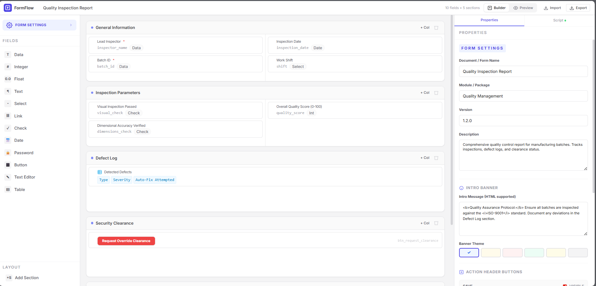
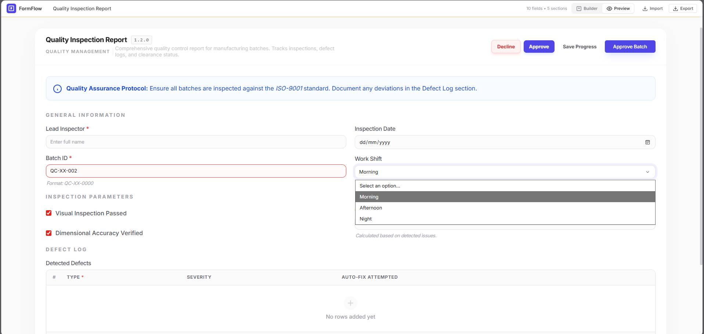

# Kai-NG-Flow: Metadata-Driven Form Engine for Angular

Kai-NG-Flow is a high-performance, open-source form builder and renderer for Angular v17+, deeply inspired by the Frappe Framework's client-side architecture. It enables developers to build complex, reactive forms using simple JSON metadata and customize behavior with a powerful, Frappe-like Scripting API.





---

## 🏗️ Core Architecture: Signal-Driven Context
The engine is built on a **Context-Injection** pattern. Every form rendered by `app-form-renderer` creates an isolated `FormContext` instance. 

1. **Metadata Core**: Forms are defined by `DocumentDefinition` JSON, which includes sections, columns, and fields.
2. **Signal-Based Reactivity**: Each field and section's internal state (label, read-only, hidden, mandatory) is wrapped in an Angular **Signal**. This allows the scripting API to update the UI instantly without complex ChangeDetection cycles.
3. **Scripting Sandbox**: Client scripts are executed in a controlled function scope where the `frm` object is injected, providing a seamless bridge between the metadata and business logic.
4. **Pluggable Utility Layer**: Common UI tasks (dialogs, alerts, API calls, loading states) are handled by a centralized `AppUtilityService`, making it easy to swap themes or backend integrations.

---

### 🛠️ Scripting API: The `frm` Object

The `frm` object is the primary way to interact with the form. Below is the comprehensive API reference with real-world use cases.

#### 1. `frm.on(event, callback)`
Listen to form lifecycle events or field changes.

*   **`refresh`**: Triggered when the form is first loaded.
    ```javascript
    frm.on('refresh', (val, frm) => { ... });
    ```
*   **`fieldname`**: Triggered when a field value changes. **NOTE**: The first argument is the new value.
    ```javascript
    // Use case: Auto-calculate totals
    frm.on('quantity', (val, frm) => {
        const price = frm.get_value('unit_price');
        frm.set_value('total', val * price);
    });
    ```

#### Grid Layout Support
The engine now supports advanced multi-column layouts via the `columns_count` property:
- **1 Column**: Full width.
- **2 Columns**: 50/50 split.
- **3 Columns**: `md:w-1/3` split.
- **4 Columns**: `md:w-1/4` split.

---

### 📦 Comprehensive Demo Data
For a deep dive into all features, refer to [example.json](file:///c:/Users/DEVELOPER/Documents/Projects/Web/kai-ng-flow/example.json). This file contains a production-grade onboarding form that utilizes:
- 3-column personal info section.
- Recursive table validation.
- Sophisticated scripting with `frm.call` and `frm.prompt`.
- Dynamic button labels and visibility.

---

### 💻 Modern Script Editor

#### 2. `frm.set_value(fieldname, value)`
Update field data. Supports overloaded syntax for batch updates.

*   **Single field update**:
    ```javascript
    frm.set_value('last_modified', new Date().toISOString());
    ```
*   **Object-based batch update (Overload)**:
    ```javascript
    // Use case: Reset multiple fields at once
    frm.set_value({
        'status': 'Draft',
        'approved_by': '',
        'approval_date': null
    });
    ```

#### 3. `frm.set_df_property(fieldname, property, value)`
Dynamically change field behavior (hidden, read_only, mandatory, label, options).

*   **Dynamic Visibility**:
    ```javascript
    // Show 'other_reason' only if 'reason' is 'Other'
    frm.on('reason', (val) => {
        frm.set_df_property('other_reason', 'hidden', val === 'Other' ? 0 : 1);
        frm.set_df_property('other_reason', 'mandatory', val === 'Other' ? 1 : 0);
    });
    ```
*   **Changing Labels**:
    ```javascript
    frm.set_df_property('tax_id', 'label', frm.get_value('country') === 'USA' ? 'SSN' : 'VAT ID');
    ```

#### 4. `frm.call(options)`
Interact with backend APIs with integrated UI management.

*   **Standard API Call**:
    ```javascript
    frm.call({
        method: 'api.v1.get_customer_details',
        args: { customer_id: 'CUST-001' },
        freeze: true,
        freeze_message: 'Fetching details...',
        callback: (r) => {
            frm.set_value('address', r.message.address);
        }
    });
    ```

#### 5. `frm.prompt(fields, callback, title)`
Collect data via a dynamic dialog with built-in validation.

*   **Interactive Input**:
    ```javascript
    // Collecting rejection reason during a workflow
    frm.add_custom_button('Reject', () => {
        frm.prompt([
            { label: 'Reason for Rejection', fieldname: 'reason', fieldtype: 'Text', mandatory: 1 },
            { label: 'Re-assign to', fieldname: 'user', fieldtype: 'Link', options: 'User' }
        ], (values) => {
            frm.call({
                method: 'reject_doc',
                args: { reason: values.reason, user: values.user },
                callback: () => frm.msgprint('Document Rejected', 'warning')
            });
        }, 'Rejection Details');
    }, 'danger');
    ```

#### 6. Default Action Overrides
Customize the behavior of standard 'Save' and 'Submit' buttons.

*   **`frm.set_button_action(id, fn)`**:
    ```javascript
    // Use case: Custom confirmation before submission
    frm.set_button_action('submit', () => {
        frm.confirm('Final submission? This cannot be undone.', () => {
            frm.msgprint('Submitting...');
            // Proceed with actual submit logic
        });
    });
    ```

| Additional Method | Description | Example |
| :--- | :--- | :--- |
| `msgprint(msg, it)` | Show a toast/alert. | `frm.msgprint('Action logged', 'info')` |
| `throw(msg)` | Show error and STOP execution. | `frm.throw('Critical failure')` |
| `set_intro(msg, clr)` | Show a persistent banner. | `frm.set_intro('Revision 2', 'blue')` |
| `freeze(msg)` | Manual loading overlay on. | `frm.freeze('Calculating...')` |
| `unfreeze()` | loading overlay off. | `frm.unfreeze()` |

---

### 🧪 Advanced Validation Logic

#### Global & Table Validation
The engine automatically runs validation on **Submission** or when `validate` hook is triggered:
1.  **Mandatory Checks**: Ensures all fields marked as `mandatory` are filled.
2.  **Regex Patterns**: Validates field content against the defined `regex` property.
3.  **Table Validation**: **NEW!** The engine now recursively validates every row in a `Table` field. If a child column is mandatory or has a regex, the entire form submission will block until the table data is corrected.

#### Prompt Validation
`frm.prompt` now supports data integrity out of the box. You can pass `mandatory: 1` or a `regex` pattern in the prompt field definitions, and the "Submit" button will only fire your callback if the input is valid.

---

### 💎 Specialized Field Types

#### 1. Datetime & Time
Standardized input types for temporal data. Uses native browser pickers styled to match the UI.

#### 2. Signature Pad
A standalone signing area.
- **Data Format**: Stores signature as a high-quality base64 PNG data URL.
- **Features**: Dedicated "Clear" action and "Captured" status indicator.

#### 3. Attach Field
A robust file management component with drag-and-drop support.
- **Configuration**: Use the `options` property to define constraints.
  - **Syntax**: `[extensions] | [max_size] | [max_files]`
  - **Example**: `.pdf,.jpg,.png | 10MB | 3`
  - **JSON Support**: You can also pass a JSON string: `{"accept": ".pdf", "maxSize": 1048576, "maxFiles": 5}`
- **Features**: 
  - Image previews for supported formats.
  - One-click downloads.
  - Automatic file size calculation and display.
  - Multi-file support (if configured).

---

#### 7. Modern Script Editor
The builder includes a professional Monaco-based editor with:
- **Intellisense**: Full type definitions for the `frm` context.
- **Snippet Library**: A searchable dropdown to instantly insert common boilerplate (Hooks, API calls, UI interactions).


---

## 🔌 Using as a Pluggable Module
To use this engine in your own project:

1. **Copy the Services**: Take `src/app/services/form-context.ts` and `src/app/services/app-utility.service.ts`.
2. **Copy the Renderer**: Include the `src/app/components/form-renderer` folder.
3. **Register Services**: Add `AppUtilityService` to your root providers and `FormContext` to the component-level providers of your host app.
4. **Invoke**:
   ```html
   <app-form-renderer [document]="mySchema" (formSubmit)="handle($event)"></app-form-renderer>
   ```

---

---

### 🚀 Advanced: Using Attach in Scripts

Developers can listen to the `Attach` field to trigger custom logic like uploading to Firebase, AWS S3, or their own CDN.

```javascript
frm.on('inspection_photos', (val, frm) => {
    if (!val) return; // File removed

    // For multi-upload, val is an array. For single, it's an object.
    const files = Array.isArray(val) ? val : [val];

    files.forEach(file => {
        // file object contains: { name, type, size, url (Base64) }
        console.log('New file attached:', file.name);

        // Example: Sending to an API
        /*
        frm.call({
            method: 'upload_to_cdn',
            args: { 
                file_name: file.name,
                file_data: file.url, // Base64 string
                mime_type: file.type
            },
            freeze: true,
            callback: (r) => frm.msgprint('Securely uploaded to CDN!')
        });
        */
    });
});
```

## 🛠️ Technical Stack
- **Engine**: Angular 17+ (Signals, Standalone Components, Control Flow)
- **Styling**: Tailwind CSS (Utilizing `animate-in`, `glassmorphism`, `modern shadows`)
- **Editor**: ngx-quill (Rich text with expansion support)
- **Icons**: Lucide-inspired SVG system
