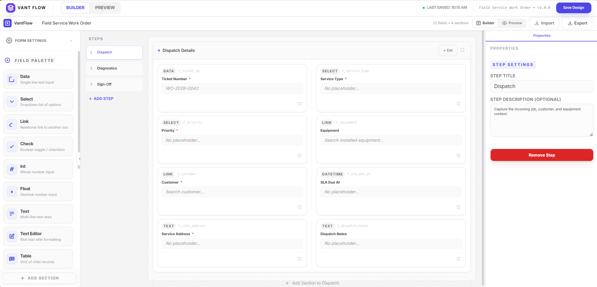
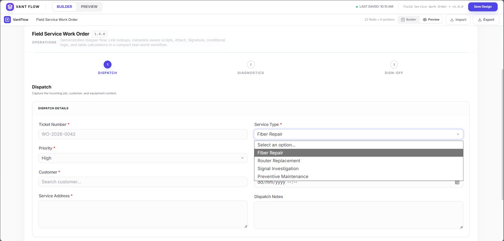
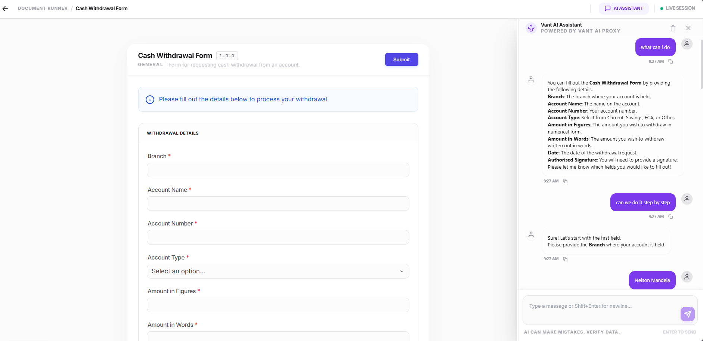
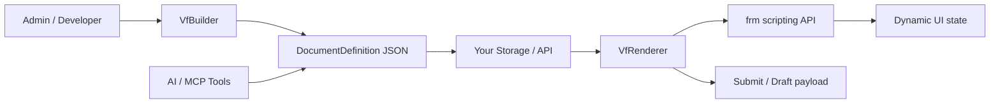

<div align="center">

# Vant Flow

**Schema-driven forms for Angular. Build once, evolve forever.**

[](https://www.npmjs.com/package/vant-flow)
[](https://angular.dev)
[](LICENSE)
[](CONTRIBUTING.md)

[**Quick Start**](#quick-start) · [**Live Demo**](#try-the-showcase-locally) · [**Docs**](data/docs/README.md) · [**Contributing**](CONTRIBUTING.md)

</div>

---

| Builder | Preview | AI Scaffold |
|---|---|---|
|  |  |  |

---

## The problem it solves

Internal business applications share one painful pattern:

- A form layout changes. A developer ships a new component.  
- A validation rule changes. A developer opens a PR.  
- A process adds a step. Six screens need updating.  
- The same form needs to render differently for three different roles.

**Vant Flow breaks that loop.** You define a form once as a `DocumentDefinition` schema — then the renderer executes it at runtime. Changing a validation rule, adding a field, or hiding a section for a role means updating data, not redeploying code.

```
Ship the engine once. Evolve forms from data.
```

---

## What makes it different

| | Raw Angular | JSON Schema (AJV/Zod) | Vant Flow |
|---|---|---|---|
| Visual builder | ❌ | ❌ | ✅ |
| Runtime business logic | Manual | ❌ | ✅ `frm` scripting API |
| Host-controlled field state | Reimplemented each time | ❌ | ✅ Built-in inputs |
| Rich fields (tables, signatures, attachments, editors) | Manual | ❌ | ✅ |
| AI schema generation | ❌ | ❌ | ✅ |
| MCP tooling | ❌ | ❌ | ✅ |
| Same schema across builder / renderer / readonly / audit | ❌ | ❌ | ✅ |

---

## How it fits together


```mermaid
flowchart LR
    A[Admin / Developer] --> B[VfBuilder]
    B --> C[DocumentDefinition JSON]
    C --> D[Your Storage / API]
    D --> E[VfRenderer]
    E --> F[frm scripting API]
    F --> G[Dynamic UI state]
    E --> H[Submit / Draft payload]
    I[AI / MCP Tools] --> C
```

Three layers in this repo:

| Layer | Path | Purpose |
|---|---|---|
| Angular library | `projects/vant-flow` | The reusable form engine |
| Reference app | `examples/vant-flow-demo` | Admin, user, preview, and submission flows |
| MCP tooling | `projects/vant-mcp` | AI-assisted schema generation and manipulation |

---

## Quick start

> **Prerequisites:** Angular 17+, Node 18+

### Install

```bash
npm install vant-flow
```

### Register the provider

```ts
// app.config.ts
import { provideVfFlow } from 'vant-flow';

export const appConfig: ApplicationConfig = {
  providers: [provideVfFlow()]
};
```

### Render a form

```html
<vf-renderer
  [document]="schema"
  [initialData]="savedData"
  [metadata]="{ currentUser: user }"
  [readonlyFields]="readonlyFields"
  [hiddenFields]="hiddenFields"
  (formAction)="handleAction($event)"
></vf-renderer>

<vf-toast-outlet></vf-toast-outlet>
```

### Open the visual builder

```html
<vf-builder
  [initialSchema]="schema"
  [showScriptEditor]="true"
  (schemaChange)="onSchemaChange($event)"
></vf-builder>
```

**That's it.** In under five minutes you have a fully interactive, script-capable form from a JSON schema. No form groups, no reactive form wiring, no `*ngIf` chains.

---

## Core concepts

### DocumentDefinition

Every form is a `DocumentDefinition` — a plain JSON object that describes structure, fields, rules, default values, actions, and optional `client_script` business logic.

```json
{
  "name": "Leave Request",
  "version": "1.0.0",
  "sections": [...],
  "actions": {
    "submit": { "label": "Submit Request", "type": "primary" }
  },
  "client_script": "frm.on('leave_type', (val, frm) => { ... })"
}
```

The same schema renders in the builder, in production, in preview, and in readonly audit mode with zero duplication.

### The `frm` scripting API

Scripts run sandboxed inside `VfFormContext`. They can shape the form without touching Angular:

```js
// React to field changes
frm.on('status', (value, frm) => {
  if (value === 'Approved') {
    frm.set_df_property('batch_id', 'read_only', true);
    frm.set_intro('Batch locked after approval.', 'green');
  }
});

// Bulk updates
frm.set_df_property(['reviewer_notes', 'finance_notes'], 'read_only', true);
frm.set_button_property(['approve', 'decline'], 'visible', false);

// Script-side validation hook
frm.on('validate', () => {
  if (!frm.get_value('approval_comment')) {
    frm.msgprint('Approval comment is required.');
    return false;
  }
});
```

### Host-controlled field and action state

For role-driven or page-level control you do not need a line of `client_script`. Pass arrays directly to the renderer:

```ts
// Angular component
readonlyFields = ['reviewer_notes', 'finance_notes'];
hiddenFields   = ['internal_comments'];
disabledActionButtons = ['submit'];
```

```html
<vf-renderer
  [document]="approvalSchema"
  [readonlyFields]="readonlyFields"
  [hiddenFields]="hiddenFields"
  [disabledActionButtons]="disabledActionButtons"
  [runFormScripts]="userHasScriptPermission"
  [metadata]="{ role: currentUser.role }"
  (formAction)="handleAction($event)"
></vf-renderer>
```

The renderer reconciles host inputs and script-driven state automatically every change cycle.

---

## Field types

| Category | Fields |
|---|---|
| **Text** | `Data`, `Text`, `Text Editor` (Quill) |
| **Numbers** | `Int`, `Float` |
| **Dates** | `Date`, `Datetime`, `Time` |
| **Selections** | `Select`, `Check`, `Link` (remote autocomplete) |
| **Rich input** | `Signature`, `Attach` (with optional camera capture), `Color` |
| **Structure** | `Table` (inline row editor), `Section Break`, `Column Break` |
| **Actions** | `Button` (custom callbacks) |
| **Flow** | Multi-step stepper with per-step validation |

---

## Runtime capabilities highlights

### Metadata injection

Pass host-only runtime context into scripts through `[metadata]`:

```ts
// Available inside scripts as frm.metadata
metadata = {
  currentUser: { name: 'Alice', role: 'Manager' },
  maxTransactionLimit: 5000
};
```

### Media handler pipeline

Plug `Attach` and `Signature` fields into your app's storage — return a compact reference URL, keep large payloads out of form state:

```ts
mediaHandler: VfMediaHandler = async (payload, context) => {
  const url = await this.storage.upload(payload.file);
  return url; // stored as field value
};
```

### Link fields with remote autocomplete

```json
{
  "fieldname": "item",
  "fieldtype": "Link",
  "link_config": {
    "data_source": "/api/items/search",
    "mapping": { "id": "id", "title": "item_name" },
    "cache": true
  }
}
```

Script hooks: `frm.set_filter(fieldname, filters)` · `frm.refresh_link(fieldname)`

### `data_group` for nested payloads

```json
{ "fieldname": "tax_number", "data_group": "kyc" }
```

Submission output: `{ kyc: { tax_number: "..." } }` — without any host-side reshaping.

---

## AI and MCP

The reference app demonstrates:

- **Admin prompt-to-schema** — type a description, upload a paper form image or PDF, or both. An AI scaffold generates a `DocumentDefinition` draft and stores explicit assumption notes on the schema.
- **AI assistant form-filling** — user-side assistant that reads form fields and guides data entry.

The **`vant-mcp` server** exposes Vant Flow concepts through the Model Context Protocol, letting AI agents scaffold, inspect, and manipulate schemas in a structured, validated way — useful for coding assistants, design tools, or internal admin pipelines.

→ [MCP architecture](data/docs/mcp-architecture.md)

---

## Try the showcase locally

```bash
git clone https://github.com/DonnC/vant-flow.git
cd vant-flow
npm install
```

| Command | What it does |
|---|---|
| `npm run dev` | Library watch build + demo app |
| `npm run dev:proxy` | + AI proxy (prompt-to-schema, uploads, assistant) |
| `npm run dev:full` | + MCP server in SSE mode |
| `npm start` | Demo app only (requires pre-built library) |
| `npm run build` | Production library build |
| `npm test` | All test suites |

For AI features, copy `.env.example` → `.env` and add your OpenAI or Gemini key. The proxy supports both; PDF understanding routes through Gemini.

### Sample AI prompts to try

```
Create a field service maintenance form for internet installation teams.
Include customer lookup, ticket number, equipment used, before-and-after
photo attachments, technician notes, customer signature, and supervisor sign-off.
```

```
Build a staff leave application form with manager approval and HR review steps.
```

```
Generate a branch compliance inspection checklist with a corrective actions table,
branch manager acknowledgment, and inspector signature.
```

Or upload any paper form image or PDF with no prompt — the AI will infer sections and list assumptions made.

---

## Repository structure

```
vant-flow/
├── projects/
│   ├── vant-flow/          # Angular library (the core engine)
│   └── vant-mcp/           # MCP server and tool definitions
├── examples/
│   └── vant-flow-demo/     # Full reference application
│       └── proxy/          # AI proxy server (Node/Express)
├── data/
│   ├── docs/               # Architecture docs and design notes
│   ├── examples/           # Importable sample schemas
│   └── screenshots/        # README and demo assets
└── scripts/                # Workspace build utilities
```

---

## Documentation

| Document | Who it is for |
|---|---|
| [Docs index](data/docs/README.md) | Start here — links organized by persona |
| [Architecture overview](data/docs/architecture-overview.md) | Anyone evaluating or forking the project |
| [Builder architecture](data/docs/builder-architecture.md) | Contributors working on the builder |
| [Renderer architecture](data/docs/renderer-architecture.md) | Contributors or integrators extending the renderer |
| [MCP architecture](data/docs/mcp-architecture.md) | AI tooling contributors or integrators |
| [Example showcase architecture](data/docs/example-showcase-architecture.md) | Contributors to the reference app |
| [Business use cases](data/docs/business-use-cases.md) | Product and solution design |

Sample schemas you can import directly into the builder:

- [Field service work order](data/examples/field-service-work-order.json)
- [Inspection report](data/examples/inspection-report.json)
- [Stepper onboarding](data/examples/example-stepper-onboarding.json)
- [Signature and attachment demo](data/examples/example-signature-attach.json)

---

## Who this fits well

Vant Flow is a strong match for:

- **Internal operations teams** — inspections, audits, compliance checklists, field service reports
- **Fintech and banking** — KYC, account opening, loan applications with multi-role approval chains
- **HR platforms** — onboarding, leave requests, performance reviews that change with policy
- **Procurement and logistics** — requisitions, work orders, delivery confirmations with photo evidence
- **Regulated industries** — anywhere the form definition lives in a database and is audited by version

The common thread: forms that change often, involve multiple roles, and need to be replayed in readonly mode for audit or history.

---

## Contributing

Contributions are welcome and appreciated. If you are using Vant Flow in a project, have hit a gap, or want to add a field type — please get involved.

→ **[Read CONTRIBUTING.md](CONTRIBUTING.md)** for setup instructions, PR workflow, commit conventions, and architecture pointers.

Good first areas to contribute:

- Additional field types
- `frm` API extensions
- Accessibility improvements on the renderer
- Additional MCP tools
- Schema migration / upgrade helpers

---

## License

[MIT](LICENSE) · Built with Angular · Inspired by the ergonomics of the [Frappe](https://frappe.io) ecosystem
