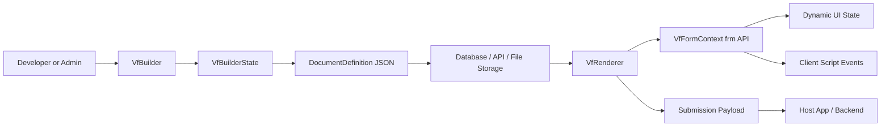
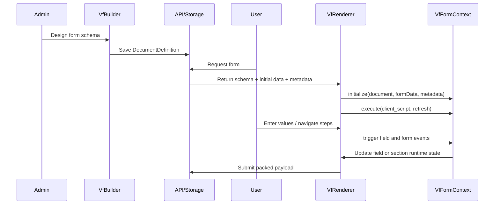

# Vant Flow Architecture Overview

## What Vant Flow Is

Vant Flow is an Angular form platform with two cooperating parts:

- `VfBuilder`: a visual designer that creates and edits a `DocumentDefinition`
- `VfRenderer`: a runtime engine that turns that document into a live form, validates it, and runs client scripts through `VfFormContext`

The schema model is centered in `projects/vant-flow/src/lib/models/document.model.ts` and describes:

- Document metadata
- Flat forms and stepper forms
- Sections, columns, and fields
- Table column definitions
- Runtime actions and optional metadata

## High-Level Architecture

## Main Building Blocks

### 1. Schema Layer

The schema is the contract between authoring and runtime. A `DocumentDefinition` can contain:

- `sections` for flat forms
- `steps` for wizard/stepper flows
- `client_script` for dynamic behavior
- `actions` for save/submit/approval patterns
- `metadata` for external hints such as AI generation flags

### 2. Builder Layer

The builder uses `VfBuilderState` as its in-memory source of truth. It handles:

- Creating sections, columns, steps, and fields
- Reordering layout with drag and drop
- Editing form metadata and field properties
- Importing and exporting schema JSON
- Toggling between design mode and live preview mode

### 3. Runtime Layer

The renderer:

- Initializes `formData` from schema defaults and incoming data
- Creates a `VfFormContext` instance
- Runs the document client script
- Reacts to `depends_on` and `mandatory_depends_on`
- Validates fields, tables, and step transitions
- Emits packed submission data back to the host app

### 4. Host Application Layer

The host app supplies:

- The stored schema
- Optional initial data
- Optional metadata for contextual logic
- Event handlers for draft save, submit, and validation errors
- Backend methods consumed through `frm.call`

## Request-to-Submission Lifecycle

## Why This Gives Developers Freedom

Vant Flow is flexible because the host app does not hardcode each workflow screen.

- New forms are data, not new Angular pages
- Layout can be flat or multi-step from the same renderer
- Business rules can come from `depends_on`, regex, actions, and client scripts
- The host can inject role, policy, or transaction context through `metadata`
- Nested payloads are supported with `data_group`
- Rich fields like attachments, signatures, text editors, and tables are first-class

## Customization Surfaces

Developers can customize Vant Flow at several layers:

- UI editor stack through `provideVfFlow()` for Monaco and Quill configuration
- Runtime form behavior through `client_script`
- Backend integration through `frm.call`
- Runtime action buttons through document `actions` and `frm.add_custom_button`
- Visibility and required logic through `depends_on` and `mandatory_depends_on`
- Data shape through `data_group`
- Role and environment awareness through renderer `metadata`

## Security and Control Model

The runtime is intentionally constrained.

- Scripts execute through `VfFormContext`
- Dangerous browser globals are documented as unavailable in the sandbox model
- Backend access should go through `frm.call` rather than arbitrary browser networking
- The script can mutate allowed form state rather than the whole application shell

## Example Deployment Patterns in This Repo

The example app shows that Vant Flow can support:

- Admin authoring and publishing of schemas
- User-facing form portals
- Storage-backed submission history
- AI-assisted schema generation
- AI-assisted field population in a running form

That combination makes Vant Flow useful as both a form engine and a workflow platform foundation.
