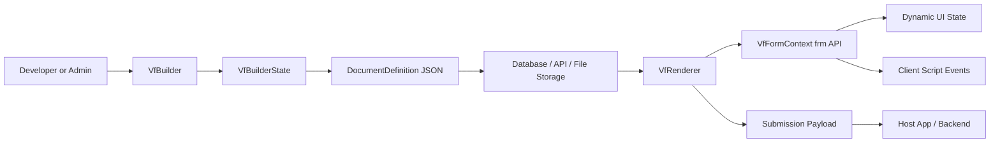
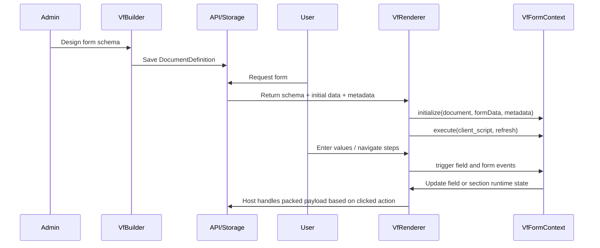

# Vant Flow Architecture Overview

## What Vant Flow Is

Vant Flow is an Angular form platform with two cooperating parts:

- `VfBuilder`: a visual designer that creates and edits a `DocumentDefinition`
- `VfRenderer`: a runtime engine that turns that document into a live form, validates it, and runs client scripts through `VfFormContext`

The schema model is centered in `projects/vant-flow/src/lib/models/document.model.ts` and describes:

- Document metadata
- Flat forms and stepper forms
- Sections, columns, and fields
- Table column definitions
- Runtime actions and optional metadata
- The default submit action and any additional runtime-defined renderer buttons
- Link field data-source configuration
- Stored media contracts and runtime media hooks

## High-Level Architecture



## Main Building Blocks

### 1. Schema Layer

The schema is the contract between authoring and runtime. A `DocumentDefinition` can contain:

- `sections` for flat forms
- `steps` for wizard/stepper flows
- `client_script` for dynamic behavior
- `actions` for the default submit button and any host-defined named actions
- `metadata` for external hints such as AI generation flags

### 2. Builder Layer

The builder uses `VfBuilderState` as its in-memory source of truth. It handles:

- Creating sections, columns, steps, and fields
- Reordering layout with drag and drop
- Editing form metadata and field properties
- Importing and exporting schema JSON
- Toggling between design mode and live preview mode

### 3. Runtime Layer

The renderer:

- Initializes `formData` from schema defaults and incoming data
- Creates a `VfFormContext` instance
- Runs the document client script
- Reacts to `depends_on` and `mandatory_depends_on`
- Validates fields, tables, and step transitions
- Emits a generalized renderer button event back to the host app

### 4. Host Application Layer

The host app supplies:

- The stored schema
- Optional initial data
- Optional metadata for contextual logic
- Optional `mediaHandler` logic for `Attach` and `Signature`
- Optional `linkDataSource` and link request observers
- Event handlers for draft save, submit, and validation errors
- A centralized button-click handler that can inspect the packed data and `frm`
- Backend methods consumed through `frm.call`

## Request-to-Submission Lifecycle



## Why This Gives Developers Freedom

Vant Flow is flexible because the host app does not hardcode each workflow screen.

- New forms are data, not new Angular pages
- Layout can be flat or multi-step from the same renderer
- Business rules can come from `depends_on`, regex, actions, and client scripts
- The host can inject role, policy, or transaction context through `metadata`
- Nested payloads are supported with `data_group`
- Rich fields like attachments, signatures, text editors, and tables are first-class
- Binary-like fields can stay lightweight in form state by using the renderer media hook
- Remote autocomplete fields can query backend endpoints without hardcoding them into the renderer

## Customization Surfaces

Developers can customize Vant Flow at several layers:

- UI editor stack through `provideVfFlow()` for Monaco and Quill configuration
- Runtime form behavior through `client_script`
- Host choice over whether renderer `client_script` executes through `runFormScripts`
- Backend integration through `frm.call`
- Binary upload and storage integration through renderer `mediaHandler`
- Remote autocomplete integration through renderer `linkDataSource`
- Runtime action buttons through document `actions` and `frm.add_custom_button`
- A single event contract for submit and custom renderer buttons
- Visibility and required logic through `depends_on` and `mandatory_depends_on`
- Host-controlled field, action-button, and script-execution state through renderer inputs such as `runFormScripts`, `readonlyFields`, `hiddenFields`, `disabledActionButtons`, and `hiddenActionButtons`
- Data shape through `data_group`
- Role and environment awareness through renderer `metadata`

## Media Hook Architecture

`Attach` and `Signature` now support a renderer-level media hook so storage integration can live in host Angular code instead of in `frm` scripts.

- `VfRenderer` can receive a `mediaHandler`
- `VfField` calls that handler before finalizing the field value
- the handler receives the raw browser payload plus field context
- the handler returns either a lightweight stored-media object, a string, or `null`

This matters because many real deployments upload to a CDN, object store, or media API and want the final form state to contain a compact reference instead of a large in-memory data URL.

The stored-media contract is intentionally open enough for backend references:

- `name`
- `url`
- optional `downloadUrl`
- optional `size`
- optional `type`
- optional `fileId`
- optional arbitrary `metadata`

That lets the UI continue to render the uploaded asset normally while the host controls how it is actually stored and downloaded.

## Link Field Architecture

The `Link` field is modeled as a remote autocomplete field rather than a static option list.

- configuration lives on `field.link_config`
- the field can use the built-in HTTP loader or a host-provided `linkDataSource`
- `mapping.id`, `mapping.title`, and `mapping.description` define how dropdown rows are displayed
- `filters` can be updated at runtime through `frm.set_filter(...)`
- `frm.refresh_link(...)` can force a reload when script logic changes the backend query context

The selected value is the full selected object, not just the ID. That keeps downstream scripts and submissions richer and closer to the original business payload.

## Security and Control Model

The runtime is intentionally constrained.

- Scripts execute through `VfFormContext`
- Dangerous browser globals are documented as unavailable in the sandbox model
- Backend access should go through `frm.call` rather than arbitrary browser networking
- The script can mutate allowed form state rather than the whole application shell

## Example Deployment Patterns in This Repo

The example app shows that Vant Flow can support:

- Admin authoring and publishing of schemas
- User-facing form portals
- Storage-backed submission history
- AI-assisted schema generation
- AI-assisted field population in a running form

One practical host pattern is to handle all renderer actions from one callback. For example:

```ts
onRendererButton(event: VfRendererButtonEvent) {
  if (event.action === 'submit') {
    return this.workflowApi.submit(event.data);
  }

  if (event.action === 'approve') {
    return this.workflowApi.approve({
      document: event.data,
      actor: event.frm.metadata?.currentUser
    });
  }
}
```

That combination makes Vant Flow useful as both a form engine and a workflow platform foundation.
