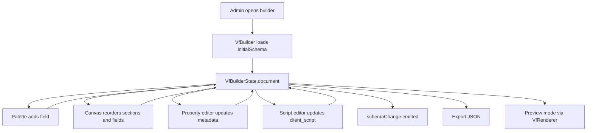
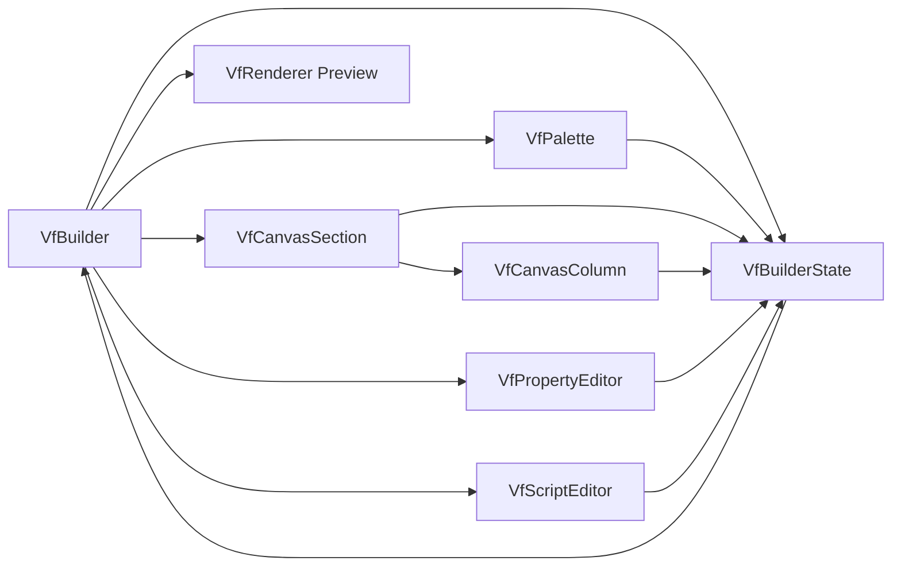
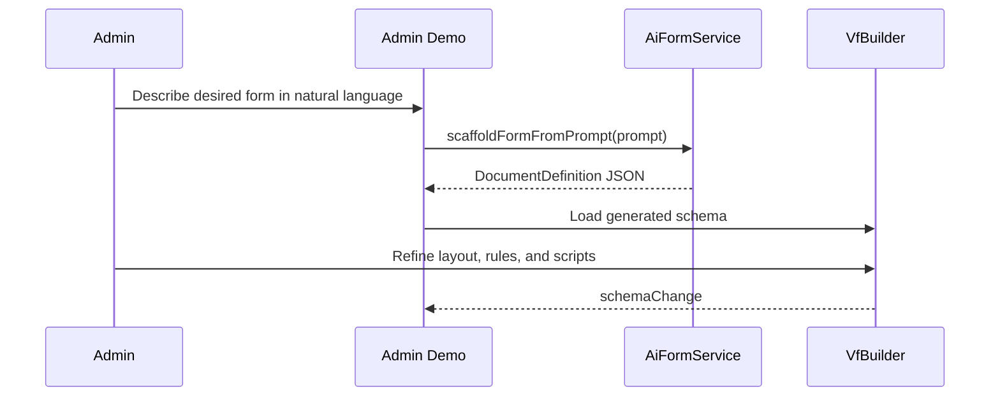

# Builder Architecture

## Purpose

`VfBuilder` is the authoring environment for producing a valid `DocumentDefinition`. It is not just a drag-and-drop canvas. It is a schema IDE with:

- document editing
- layout composition
- field configuration
- scripting support
- import/export
- live preview through the same renderer used at runtime

## Main Components

- `VfBuilder` orchestrates the full authoring shell
- `VfBuilderState` stores the active document and all current selections
- `VfPalette` exposes available field types
- `VfCanvasSection` and `VfCanvasColumn` render editable layout zones
- `VfPropertyEditor` edits document, section, step, and field properties
- `VfScriptEditor` edits the `client_script`
- `VfRenderer` is embedded in preview mode to show the live result

## Builder Flow

## State Model

`VfBuilderState` is the builder backbone. It owns:

- `document`
- selected field, section, and step ids
- form settings visibility
- current mode: `builder` or `preview`
- dynamic intro state

It also exposes computed lookups so the UI can cheaply resolve:

- selected field
- selected section
- selected step
- data group suggestions

## Authoring Operations

The builder supports these structural operations directly in state:

- add, update, and remove steps
- add, update, and remove sections
- add and remove columns
- add, update, move, and remove fields
- add, update, and remove table columns
- import full schema JSON
- export current document JSON

## Builder Component Relationships

## How the Builder Gives Developers Freedom

### Flexible Layout Authoring

A form can be modeled as:

- a classic section-based document
- a guided stepper workflow
- a hybrid business document with collapsible sections and rich fields

Developers do not need separate page components for each case.

### Property-Driven Behavior

Most behavior is declarative and stored in the schema:

- labels
- placeholders
- defaults
- regex rules
- hidden and read-only flags
- conditional visibility
- conditional mandatory rules
- nested `data_group` paths

That means teams can change business behavior by editing metadata instead of rebuilding the app.

### Embedded Scripting

The script editor turns the builder into a runtime behavior authoring tool, not just a layout editor. Developers can attach `frm` logic to:

- `refresh`
- field-change events
- step transitions
- custom actions

### Live Preview

Builder preview runs the same renderer component used in production. That shortens the gap between authored intent and executed behavior.

## Builder + AI Workflow in Example App

The example admin flow shows an additional authoring path:

This is important architecturally because it proves the builder accepts schema from multiple sources:

- manual design
- imported JSON
- AI-generated scaffolds
- persisted database records

## Builder Outputs

The builder’s primary artifact is a `DocumentDefinition`. That artifact is portable and can be:

- saved to a backend
- versioned
- loaded into preview
- rendered in user-facing apps
- passed through AI tooling
- reused across subsidiaries or business units
