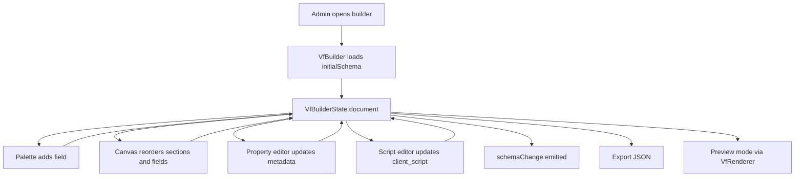
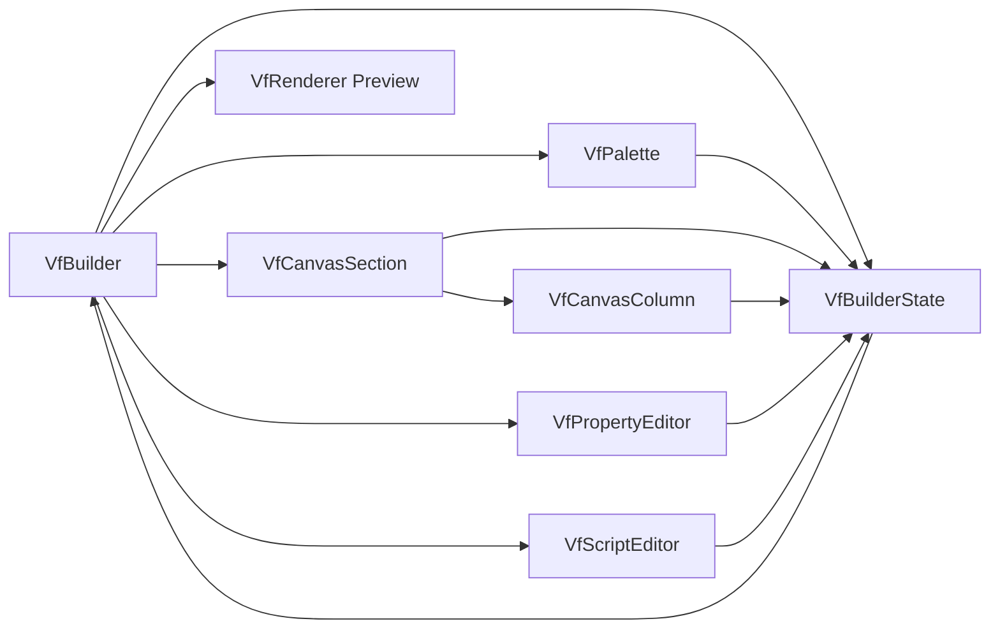
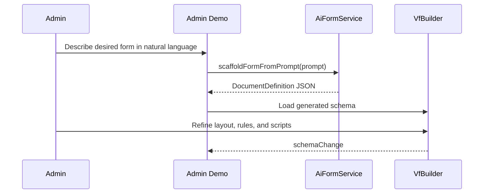

# Builder Architecture

## Purpose

`VfBuilder` is the authoring environment for producing a valid `DocumentDefinition`. It is not just a drag-and-drop canvas. It is a schema IDE with:

- document editing
- layout composition
- field configuration
- scripting support
- import/export
- live preview through the same renderer used at runtime

## Main Components

- `VfBuilder` orchestrates the full authoring shell
- `VfBuilderState` stores the active document and all current selections
- `VfPalette` exposes available field types
- `VfCanvasSection` and `VfCanvasColumn` render editable layout zones
- `VfPropertyEditor` edits document, section, step, and field properties
- `VfScriptEditor` edits the `client_script`
- `VfRenderer` is embedded in preview mode to show the live result

Important host-facing builder input:

- `showScriptEditor` controls whether the script tab is available in builder mode

## Builder Flow



## State Model

`VfBuilderState` is the builder backbone. It owns:

- `document`
- selected field, section, and step ids
- form settings visibility
- current mode: `builder` or `preview`
- dynamic intro state

It also exposes computed lookups so the UI can cheaply resolve:

- selected field
- selected section
- selected step
- data group suggestions

## Authoring Operations

The builder supports these structural operations directly in state:

- add, update, and remove steps
- add, update, and remove sections
- add and remove columns
- add, update, move, and remove fields
- add, update, and remove table columns
- import full schema JSON
- export current document JSON

## Builder Component Relationships



## How the Builder Gives Developers Freedom

### Flexible Layout Authoring

A form can be modeled as:

- a classic section-based document
- a guided stepper workflow
- a hybrid business document with collapsible sections and rich fields

Developers do not need separate page components for each case.

### Property-Driven Behavior

Most behavior is declarative and stored in the schema:

- labels
- placeholders
- defaults
- regex rules
- hidden and read-only flags
- conditional visibility
- conditional mandatory rules
- nested `data_group` paths

That means teams can change business behavior by editing metadata instead of rebuilding the app.

### Authoring New Runtime Integrations

The builder now exposes configuration for deeper runtime features without requiring hand-edited JSON.

- `Link` fields can define `link_config.data_source`
- `Link` fields can define mapping for `id`, `title`, and optional `description`
- `Link` fields can define initial `filters`
- those mappings can use nested dot-paths such as `record.id` or `profile.display_name`

This is important because the builder is not only editing labels and placeholders anymore. It is authoring how the runtime will talk to backend search endpoints and how returned business objects are interpreted.

### Embedded Scripting

The script editor turns the builder into a runtime behavior authoring tool, not just a layout editor. Developers can attach `frm` logic to:

- `refresh`
- field-change events
- step transitions
- custom actions

Host applications can also disable this authoring surface entirely by setting `showScriptEditor` to `false` on `VfBuilder`. When that flag is off, the builder keeps the properties panel but hides the script tab so teams can allow schema editing without exposing client-script editing.

Example:

```html
<vf-builder
  [initialSchema]="document"
  [previewMetadata]="previewMetadata"
  [showScriptEditor]="false"
  (schemaChange)="onSchemaChange($event)"
></vf-builder>
```

It also now documents and autocompletes newer runtime APIs such as:

- `frm.set_filter(fieldname, filters)` for Link fields
- `frm.refresh_link(fieldname)` to reload remote autocomplete results
- `frm.metadata` access for runtime host context

This keeps script authoring aligned with the live capabilities of the renderer and `VfFormContext`.

### Live Preview

Builder preview runs the same renderer component used in production. That shortens the gap between authored intent and executed behavior.

Preview also has a dedicated runtime metadata editor. That editor feeds `frm.metadata` into the embedded renderer without mutating the underlying `DocumentDefinition`. Architecturally, that is an important distinction:

- `DocumentDefinition.metadata` is persisted schema metadata
- builder preview metadata is runtime-only host context for testing scripts

This makes preview suitable for validating role-aware or environment-aware client scripts before a real backend is connected.

## How New Field Features Surface in the Builder

### Link Fields

When a field is configured as `Link`, the property editor becomes the schema authoring surface for a remote autocomplete contract.

- `data_source` points to the endpoint
- `mapping.id` identifies the stable key
- `mapping.title` controls the visible label in the autocomplete
- `mapping.description` controls the optional secondary text
- `filters` defines initial backend query context
- request settings such as HTTP method and minimum query length shape runtime loading behavior

The builder does not execute backend fetching itself. It persists the contract that the runtime renderer will use later.

### Attach and Signature

`Attach` and `Signature` remain schema-first fields in the builder, but their storage behavior is intentionally runtime-owned.

- the builder defines the field presence and user-facing constraints
- the host renderer can later inject a `mediaHandler`
- the runtime field value can end up as a CDN reference object instead of a raw data URL

That split keeps the schema portable while still allowing projects to plug in cloud storage, object stores, or internal media services.

## Builder + AI Workflow in Example App

The example admin flow shows an additional authoring path:



This is important architecturally because it proves the builder accepts schema from multiple sources:

- manual design
- imported JSON
- AI-generated scaffolds
- persisted database records

## Builder Outputs

The builder’s primary artifact is a `DocumentDefinition`. That artifact is portable and can be:

- saved to a backend
- versioned
- loaded into preview
- rendered in user-facing apps
- passed through AI tooling
- reused across subsidiaries or business units
