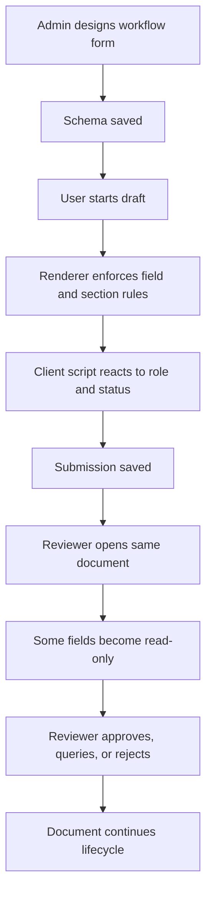

# Vant Flow Business Use Cases

## Why This Architecture Fits Real Business Work

Vant Flow is strongest where forms are not simple surveys, but living business documents with:

- role-based visibility
- approval routing
- changing regulatory rules
- nested data capture
- attachments and signatures
- repeated child rows
- revisable workflows instead of one-time submission

## Capability-to-Problem Mapping

| Capability | Business Problem It Solves |
| --- | --- |
| Stepper forms | Long onboarding, KYC, and application flows |
| `depends_on` and `mandatory_depends_on` | Conditional policy rules and progressive disclosure |
| `frm.set_df_property` | Role- or status-driven runtime control |
| Table fields | Line items, asset lists, votes, checklist rows |
| `Attach` and `Signature` | Evidence collection and paperless approval |
| `data_group` | Mapping UI fields to nested backend DTOs |
| `frm.call` | Backend validation, lookups, and side effects |
| `metadata` injection | Role, branch, limit, or product-aware behavior |
| Custom buttons and actions | Approve, reject, escalate, forward, review |

## Business Scenarios This Repo Already Supports Well

### 1. Onboarding and KYC

Good fit because the library already supports:

- stepper progression
- document uploads
- conditional fields
- nested output payloads
- read-only handoff patterns

Typical examples:

- employee onboarding
- customer account opening
- vendor registration
- tenant onboarding

### 2. Inspections and Field Operations

Good fit because the renderer supports:

- tables for checkpoints and asset lines
- rich text for findings
- image or file attachments
- signatures
- mobile-friendly schema-driven execution

Typical examples:

- site inspections
- vehicle inspections
- equipment audits
- safety incident reports

### 3. Financial and Administrative Requests

Good fit because Vant Flow can model:

- draft and submit actions
- approval states
- receipt attachments
- row-based calculations and review
- role-dependent editability

Typical examples:

- expense claims
- petty cash requests
- travel and subsistence requests
- supplier invoice capture

### 4. Governance and Committee Processes

Good fit because forms can become controlled workflow documents rather than one-shot submissions.

Typical examples:

- board minutes
- approval memos
- committee voting records
- contract review checklists

## Example Business Lifecycle

## How Developers Stay in Control

Vant Flow creates freedom without forcing teams into a black box.

- The schema is plain JSON
- The host app still owns storage, auth, roles, and APIs
- Scripts are explicit and local to the form definition
- Metadata injection lets the host shape behavior without forking the library
- The same document can evolve across departments with minimal frontend churn

## Example High-Value Industries

The repository’s examples and notes point to strong fit in:

- banking and microfinance
- insurance and claims
- land development and construction
- internal operations and procurement
- public sector or NGO intake workflows
- enterprise shared services across multiple subsidiaries

## Why This Matters Strategically

For teams building many operational forms, the main win is not just speed of building screens. It is reducing the cost of change.

When rules change, teams can often update:

- schema JSON
- client script
- metadata supplied by the host

instead of building and releasing a new custom page for each workflow variation.
