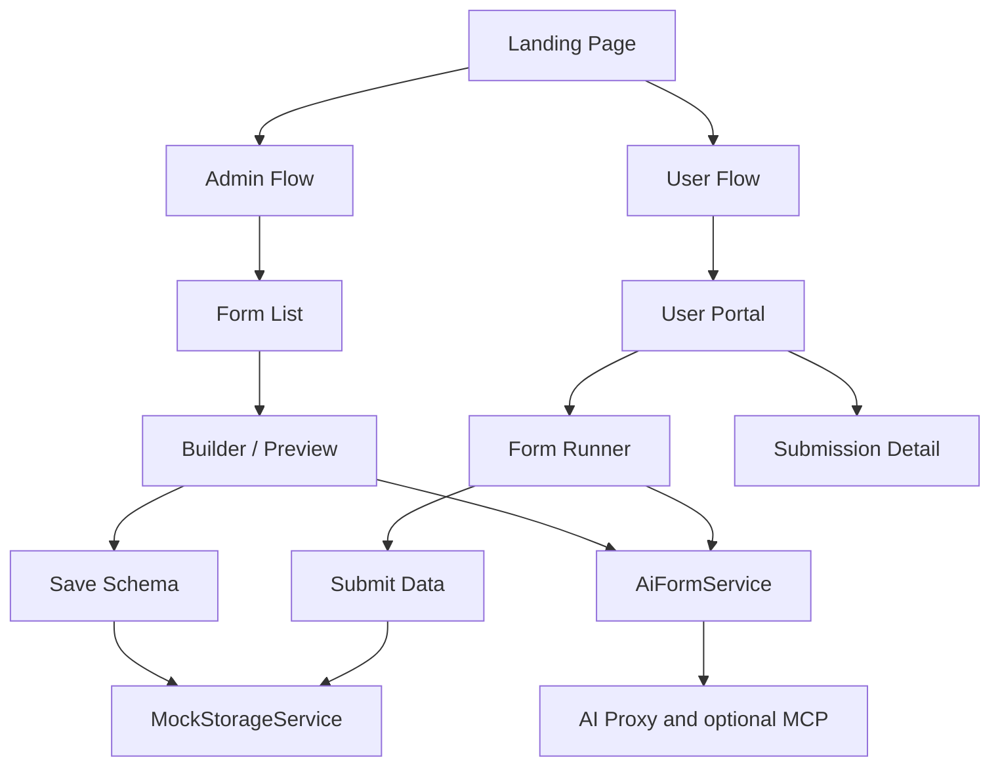
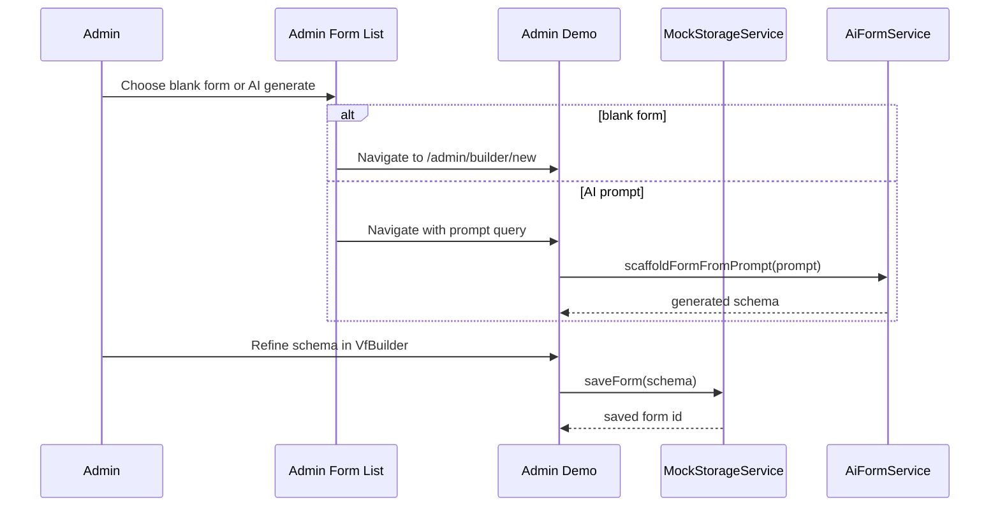
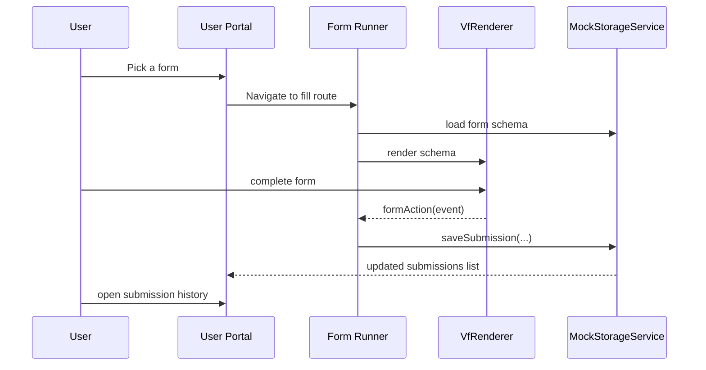
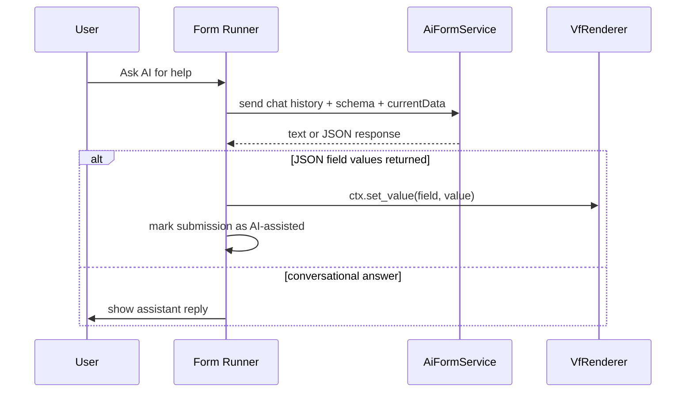

# Example Showcase Architecture

## Purpose

`examples/kai-ng-flow` is not just a demo page. It is a reference application that shows how the Vant Flow library can be used as a small product platform with:

- admin authoring
- user-facing execution
- schema persistence
- submission history
- AI-assisted generation
- AI-assisted runtime form filling

## What the Example App Showcases

The app demonstrates different aspects of the project by splitting them into real workflow surfaces:

- landing page for product positioning
- admin design workspace
- renderer preview
- user form portal
- submission history and readonly replay
- AI-assisted admin scaffolding
- AI-assisted user completion

## Application Structure

## Routing Story

The route map itself shows the showcase intent:

- `/` introduces the product
- `/admin` lists and manages designs
- `/admin/builder/:id` edits or previews a form
- `/user` lists available forms and submissions
- `/user/fill/:id` runs a live form
- `/user/submission/:id` replays a saved submission in readonly mode

## Admin Showcase

The admin side demonstrates how teams would actually work with Vant Flow in production.

### What it highlights

- reusable schema storage
- opening existing forms by id
- creating blank forms
- AI-generated starting schemas
- switching between builder and renderer preview
- saving updates back to storage

### Admin flow

This is the clearest showcase of the builder as a productized authoring environment rather than a standalone widget.

## User Showcase

The user side demonstrates the renderer in a more realistic operating context.

### What it highlights

- listing published forms
- filling a saved schema
- submitting real payloads
- tracking submission history
- replaying submitted data in readonly mode

### User flow

## AI Showcase

The example app showcases AI in two distinct ways.

### 1. Admin-side AI schema generation

The admin can describe a form in natural language and receive a generated schema that is then refined visually.

This shows:

- prompt-to-schema generation
- schema-first AI integration
- human-in-the-loop refinement

### 2. User-side AI form assistance

The form runner opens an AI side panel that:

- reads the live schema
- reads current form state
- responds conversationally
- can return JSON field updates
- applies those values into the real renderer using `frm.set_value`

This is one of the strongest showcases in the repo because it proves the renderer can be controlled through a structured runtime API, not just direct user typing.

## Persistence Showcase

`MockStorageService` demonstrates the storage contract the real app would need.

It manages:

- form design records
- submission records
- optimistic local reactive state
- backend API synchronization

That makes the example useful for explaining how Vant Flow plugs into a broader app, not only how it renders controls.

## Readonly Replay Showcase

`SubmissionDetailComponent` is especially important because it shows a high-value enterprise behavior:

- render the same schema again
- bind historical data
- force readonly mode
- inspect raw JSON side by side

That pattern is useful for audit trails, customer support, compliance review, and approval workflows.

## Why This Example Project Is Valuable

The demo app showcases different aspects of Vant Flow in one place:

- builder as an admin IDE
- renderer as a runtime engine
- schema persistence as application infrastructure
- AI as both authoring and filling assistant
- readonly replay as an audit and review capability
- role-separated flows for internal teams and end users

In other words, it demonstrates not just what the components are, but what kind of product teams can build with them.
