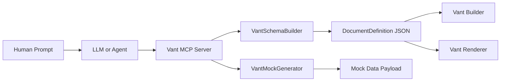
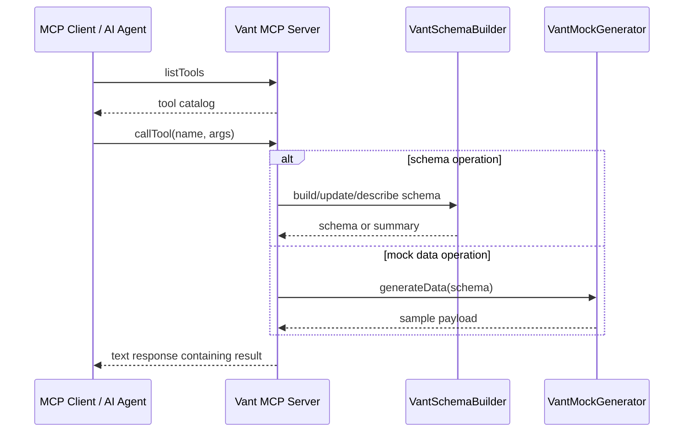

# Vant MCP Architecture

## Purpose

`projects/vant-mcp` turns Vant Flow into an MCP-compatible tool server so AI systems can work with the same schema model that powers the builder and renderer.

Instead of generating vague UI advice, the MCP project gives agents a structured tool layer for:

- learning the Vant schema model
- generating or modifying `DocumentDefinition` JSON
- describing schemas
- scaffolding forms from blueprints
- updating fields and client scripts
- generating mock payloads for testing

## Architectural Role in the Workspace



The MCP project is not a separate form engine. It is an agent-facing schema and workflow adapter around the main Vant Flow model.

## Runtime Modes

The server supports two transport modes:

- `stdio` for local MCP clients and Inspector workflows
- `sse` for networked tool access from the demo app or external clients

```mermaid
flowchart TD
    A[Start MCP server] --> B{TRANSPORT}
    B -->|stdio| C[StdioServerTransport]
    B -->|sse| D[Express App]
    D --> E[/sse endpoint]
    D --> F[/messages endpoint]
    E --> G[SSEServerTransport per session]
    C --> H[Tool handlers]
    G --> H
    H --> I[Schema builder or mock generator]
```

## Main Components

### `src/index.ts`

This is the server entry point. It:

- creates the MCP server
- registers tool definitions
- dispatches tool calls
- supports `stdio` and `sse`
- writes operational logs to `logs/mcp.log`
- keeps SSE sessions alive and tracks connected transports

### `VantSchemaBuilder`

This is the main schema manipulation engine. It provides:

- `buildFromBlueprint`
- `buildFromPrompt`
- `addStep`
- `addSection`
- `addField`
- `updateField`
- `generateSummary`

It is the structural bridge between high-level requests and valid Vant schema objects.

### `VantMockGenerator`

This generates test payloads from a schema by walking all fields and returning sample values for each supported field type.

That makes the MCP useful not only for creation, but also for QA and simulation.

## Tool Surface

The current MCP implementation exposes tools for four main jobs.

### 1. Knowledge and Discovery

- `get_models`
- `get_field_types`
- `analyze_schema`
- `describe_schema`

These help an agent understand the schema contract before making changes.

### 2. Structured Form Creation

- `create_form_from_prompt`
- `scaffold_from_blueprint`

These help an agent move from natural language or a structured blueprint into schema JSON.

### 3. Incremental Schema Editing

- `add_step`
- `add_section`
- `add_field`
- `update_field`
- `update_client_script`
- `configure_actions`

These let an agent refine a form instead of regenerating it from scratch.

### 4. Simulation

- `generate_mock_data`

This gives the agent realistic sample payloads for preview, testing, and demo flows.

## Tool Dispatch Flow



## How the MCP Project Gives Developers Freedom

The MCP layer expands who can author forms and how they do it.

- Humans can still use the visual builder
- Agents can generate or refine the same schema model through tools
- Teams can automate repetitive form authoring tasks
- AI integrations can stay schema-aware instead of inventing custom formats
- The same backend form definition can be shared between manual and agentic workflows

## Why It Matters Architecturally

Without the MCP layer, AI features would need app-specific prompt engineering and brittle parsing. With the MCP layer:

- Vant’s schema becomes the standard contract
- tool operations are bounded and explicit
- AI output can be refined step by step
- mock data can be generated from the same schema definition
- the demo app can use live MCP guidance while still relying on the main library

## Relationship to the Demo App

The example app’s `AiFormService` can connect to the MCP server over SSE. That means:

- admin-side AI scaffolding can benefit from live tool guidance
- the UI and MCP server can share one schema vocabulary
- future AI workflows can move from plain prompt completion to richer tool-driven orchestration

## Current Constraints

The current implementation is intentionally lightweight.

- many tools return text payloads rather than strongly typed MCP objects
- `create_form_from_prompt` currently returns guidance text, not a final generated schema
- schema analysis is still basic in places
- real intelligence often comes from combining this MCP guidance with an external model

That is still valuable, because the project already establishes the protocol boundary and reusable schema operations.
