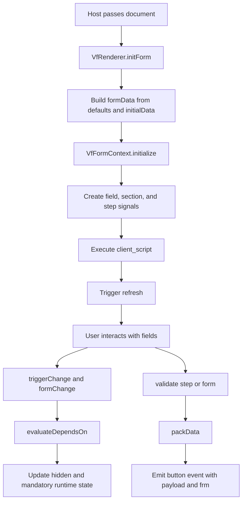
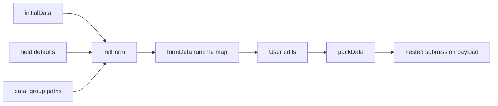
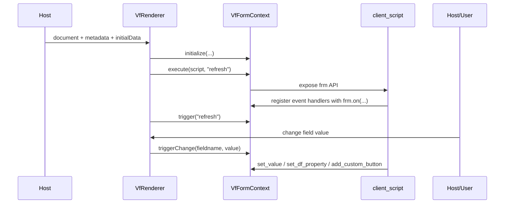

# Renderer Architecture

## Purpose

`VfRenderer` is the runtime engine that turns a `DocumentDefinition` into an interactive business form. It is responsible for:

- initializing values
- rendering fields and sections
- executing client scripts
- enforcing conditional logic
- validating data
- handling stepper navigation
- emitting button-click events with the packed payload and runtime context

## Runtime Flow



## Core Runtime Actors

### `VfRenderer`

Owns the Angular component lifecycle and presentation. It:

- accepts `document`, `initialData`, `metadata`, and flags
- accepts optional `mediaHandler`, `linkDataSource`, and `linkRequestObserver`
- initializes `formData`
- emits `formReady`, `formChange`, `formAction`, and `formError`
- manages full-form and per-step validation
- exposes `validate()` and `validateStep()` for host-side callers
- packs flat runtime state back into nested output using `data_group`
- exposes a single default `Submit` button unless teams add more buttons at runtime

The emitted host callbacks follow a consistent pattern:

- `formAction` includes `frm`
- `formChange` includes `frm`
- `mediaHandler` receives a context object with `frm`
- `linkDataSource` request objects include `frm`
- `linkRequestObserver` state objects include `frm`

Example host usage:

```ts
onFormAction(event: VfRendererButtonEvent) {
  if (!event.frm.validate()) {
    return false;
  }
}

onFormChange(event: VfRendererChangeEvent) {
  if (event.fieldname === 'approval_comment') {
    event.frm.validate();
  }
}

mediaHandler: VfMediaHandler = async (payload, context) => {
  if (!context.frm.validate()) {
    throw new Error('Fix validation first.');
  }
  return `mock://${context.fieldname}`;
};
```

If a custom button callback or runtime action returns `false`, the renderer does not emit `formAction`. That makes failed validation behave like the default submit flow: invalid fields are shown, and the action stops there.

### `VfFormContext`

This is the `frm` runtime API exposed to client scripts. It manages:

- runtime field signals
- runtime section signals
- runtime step signals
- event listeners
- custom buttons
- runtime button labels and button actions
- runtime button visibility and readonly behavior
- readonly state
- dynamic intro banners
- metadata access
- link refresh signals
- optional media and link integration hooks

## Context API Capabilities

The current implementation supports patterns like:

- `frm.on(...)`
- `frm.get_value(...)`
- `frm.set_value(...)`
- `frm.set_df_property(...)`
- `frm.set_df_property([...], ...)`
- `frm.set_section_property(...)`
- `frm.validate()` and `frm.validate_step()`
- `frm.set_intro(...)`
- `frm.add_row(...)` and `frm.remove_row(...)`
- `frm.next_step()` and `frm.go_to_step(...)`
- `frm.add_custom_button(...)`
- `frm.set_button_label(...)`
- `frm.set_button_action(...)`
- `frm.set_button_property(...)`
- `frm.call(...)`
- `frm.set_filter(...)`
- `frm.refresh_link(...)`
- `frm.confirm(...)`, `frm.prompt(...)`, and `frm.msgprint(...)`

## Data Initialization and Packing

The renderer converts external input into runtime form state, then later converts runtime state back into a business payload.

## Host-Driven Runtime Control

`VfRenderer` can now receive host-owned controls so Angular code can decide both whether schema scripts execute at all and how field/button state should be overridden without pushing every rule into `client_script`.

Supported inputs:

- `runFormScripts`
- `readonlyFields`
- `hiddenFields`
- `disabledActionButtons`
- `hiddenActionButtons`

These inputs are applied after renderer initialization and again whenever the bound arrays change.

Example:

```html
<vf-renderer
  [document]="schema"
  [runFormScripts]="false"
  [readonlyFields]="['reviewer_notes', 'finance_notes', 'approve_step']"
  [hiddenFields]="['internal_comments']"
  [disabledActionButtons]="['submit', 'approve']"
  [hiddenActionButtons]="['decline']"
  [metadata]="metadata"
></vf-renderer>
```

This gives host teams a clean split:

- use `runFormScripts` when schema-authored scripts should be fully allowed or fully suppressed in a given host surface
- use renderer inputs for page-level workflow state such as approval stage, route context, or role context already known by the app
- use `frm` methods for dynamic reactions that happen inside the form at runtime

Behavior details:

- `runFormScripts = false` skips `document.client_script` execution and ignores schema action-script strings
- `readonlyFields` and `hiddenFields` target runtime document fields, including field-level `Button` fields
- `disabledActionButtons` and `hiddenActionButtons` target renderer header action buttons such as `submit`, `approve`, and `decline`
- removing an item from one of these arrays restores the default runtime state for that override



Key behavior:

- `Check` fields normalize to `1` or `0`
- `Table` fields normalize rows and attach `idx`
- `data_group` lets developers map flat fields into nested objects at submit time

## Runtime Action Model

The renderer now ships with one default header action:

- `Submit`

That button can still be relabeled or restyled through `document.actions.submit`, but additional workflow buttons are expected to be added intentionally by the host team, not exposed as fixed default schema settings.

In practice, teams now have three action paths:

- keep the default `Submit` button
- change its label or style with `document.actions.submit`
- add more buttons at runtime through `frm.add_custom_button(...)` or host code

When any of those renderer-level buttons are clicked, `formAction` emits a general button event instead of a submit-only payload.

The host receives:

- `action`
- `buttonName`
- packed `data`
- `rawData`
- `frm`
- `source`

That gives the host one centralized integration point for real business workflows.

### Real-World Example

An insurance claims app might use one global callback like this:

```ts
onRendererButton(event: VfRendererButtonEvent) {
  switch (event.action) {
    case 'submit':
      return this.claimApi.submit(event.data);
    case 'approve':
      return this.claimApi.approve({
        claim: event.data,
        reviewer: event.frm.metadata?.currentUser
      });
    case 'request_more_info':
      return this.claimApi.requestMoreInfo(event.rawData);
  }
}
```

That is cleaner than wiring a separate output for each possible workflow action.

## Conditional Logic Model

The renderer implements two complementary dynamic systems.

### Declarative Conditions

Through schema properties:

- `depends_on`
- `mandatory_depends_on`

These expressions are evaluated against `formData` and then update runtime field and section state.

### Scripted Conditions

Through `client_script`, teams can respond to events and mutate runtime state with `frm`.

That split is powerful:

- declarative rules handle common visibility and required-state logic
- scripts handle richer process logic, role-aware behavior, messaging, and async calls

## Script Execution Model



The implementation currently executes the script to register handlers, then drives behavior through explicit `trigger(...)` calls from the renderer lifecycle and field changes.

## Stepper Runtime

Stepper documents use `currentStepIndex` in the form context. The renderer provides:

- progress UI
- previous and next navigation
- per-step validation
- visibility-aware skipping of hidden steps
- final submit-action triggering on the last step

That makes it suitable for onboarding, KYC, multi-stage approvals, and inspections.

## Validation Model

The runtime validates:

- mandatory fields
- regex patterns
- mandatory table cells
- regex rules inside table cells
- optional scripted `validate` event logic
- host-side `VfRenderer.validate()` and script-side `frm.validate()` both invoke the same validation flow as the default submit button

Validation respects runtime state, so hidden sections and hidden fields are skipped.

### Validation Examples

Host-side usage:

```ts
@ViewChild(VfRenderer) renderer?: VfRenderer;

runApprovalCheck() {
  const ok = this.renderer?.validate();
  if (!ok) {
    return;
  }
  this.workflowApi.advance();
}
```

Script-side usage:

```js
frm.on('approve', () => {
  if (!frm.validate()) {
    return false;
  }

  frm.msgprint('Form is valid. Continue with approval logic.');
});
```

Use `frm.on('validate', ...)` when you want to add custom validation rules that run after the built-in field checks:

```js
frm.on('validate', () => {
  if (!frm.get_value('approval_comment')) {
    frm.msgprint('Approval comment is required');
    return false;
  }
});
```

`frm.validate()` is safe to call from other hooks like `refresh`, custom button actions, and `before_step_change`. If it is called from inside the `validate` hook itself, it falls back to the base field checks so it does not recurse.

## Backend and Host Integration

The renderer is designed to stay host-agnostic.

- The host decides where schemas live
- The host decides what metadata to inject
- The host decides how media uploads or signature persistence work
- The host decides whether link lookups use built-in HTTP fetching or a custom data-source function
- The host decides what to do when any renderer button is clicked
- Runtime network work is funneled through `frm.call`

## Media Field Pipeline

`Attach` and `Signature` now use a richer runtime pipeline so the user experience can stay simple while storage logic remains application-owned.

### Why the Hook Exists

Without a dedicated hook, an attachment flow often has to:

- read a file into memory
- emit a base64-heavy form value
- detect that change later from `formChange`
- upload it in a second pass
- overwrite the field again with the final backend reference

That works, but it is wasteful for large files and awkward for CDN or cloud-storage workflows.

### Current Media Hook Model

The renderer can receive a `mediaHandler`. `VfField` invokes it before finalizing the value for:

- `Attach`, with the raw `File`
- `Signature`, with a `Blob` and data URL context

The handler also receives:

- the field definition
- `fieldname`
- `fieldtype`
- the current field value
- runtime `formMetadata`

The return value can be:

- a string
- a stored-media object
- `null`

### Stored Media Contract

The stored-media object supports:

- `name`
- `url`
- optional `downloadUrl`
- optional `size`
- optional `type`
- optional `fileId`
- optional custom `metadata`

This means the end user still interacts with the standard Attach or Signature UI, but the runtime value can become a compact cloud-reference object instead of raw uploaded bytes.

### Download Behavior

The UI resolves downloads using:

- `downloadUrl` first
- then `url` as a fallback

That allows teams to separate preview URLs from download URLs when the backing storage system needs different endpoints or signed links.

## Link Field Runtime Model

The `Link` field is designed as a Frappe-style remote autocomplete field.

### Configuration Surface

`field.link_config` can define:

- `data_source`
- `mapping.id`
- `mapping.title`
- optional `mapping.description`
- `filters`
- `method`
- `search_param`
- `limit_param`
- `results_path`
- `cache`
- `min_query_length`
- `page_size`

### Fetch Timing

The field does not eagerly fetch all configured links during renderer boot. It fetches lazily:

- when the input is focused/opened
- when the search query changes
- when filters change and the field is refreshed

This keeps startup cost lower and matches autocomplete behavior better.

### Response Contract

The built-in loader accepts:

- a raw array response
- or an object containing the results under `results_path`
- or fallback object keys: `results`, `items`, or `data`

Nested dot-paths are supported for both `results_path` and mapping keys. That means backend responses like `payload.data.items` and nested fields like `record.profile.display_name` work without a custom adapter.

### Built-In Request Shape

In built-in `GET` mode, the renderer sends:

- search term
- page size
- `fieldname`
- `fieldtype`
- filters as `filters.<key>=value`

In built-in `POST` mode, it sends a body containing:

- search term
- page size
- `fieldname`
- `fieldtype`
- `filters`

The default parameter names are `q` and `limit`, but they can be renamed with `search_param` and `limit_param`.

### Selection and Submission

Unlike a plain `Select`, the `Link` field stores the full selected object. This is deliberate.

- scripts can inspect richer business data after selection
- packed form submissions retain the chosen object
- downstream systems are not forced to immediately re-hydrate an ID back into a record

### Runtime Script Control

Client scripts can influence Link behavior through:

- `frm.set_filter(fieldname, filters)` to change backend query filters
- `frm.refresh_link(fieldname)` to force a reload using the latest filters
- `frm.set_value(...)` and `frm.get_value(...)` on the selected object itself

This keeps transport in host code, while still letting business logic shape lookup behavior inside the schema.

### Request State Observation

The renderer can also receive a `linkRequestObserver`. That gives host code visibility into:

- loading
- success
- error
- result count
- the query and active filters

That makes it possible to add logging, metrics, user feedback, or shared caching strategies outside the form script sandbox.

## Renderer in the Example App

The example app demonstrates three practical runtime patterns:

1. Standalone renderer preview for schema testing
2. Admin-side preview embedded next to the builder
3. User portal execution with saved submissions and AI assistance

## Why the Renderer Gives Teams Real Flexibility

The renderer is reusable because it separates stable infrastructure from changing business requirements.

- The component stays the same while schemas evolve
- Different industries can share one rendering engine
- Scripts and metadata let teams tailor behavior per role, tenant, or workflow state
- Complex field types avoid custom one-off widgets for each project
