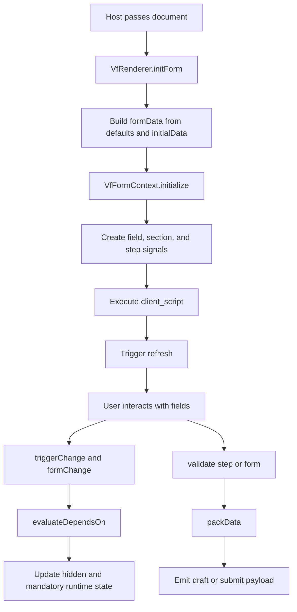
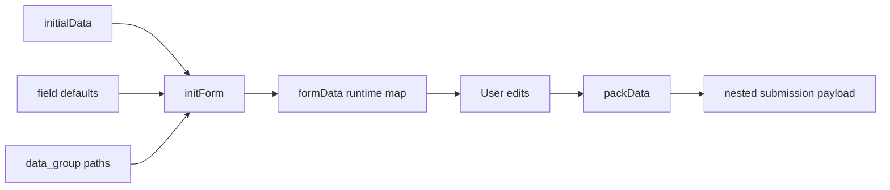
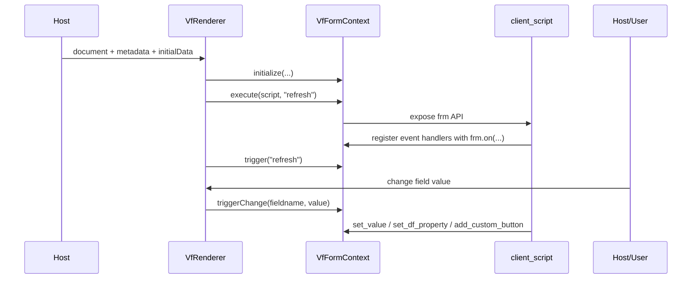

# Renderer Architecture

## Purpose

`VfRenderer` is the runtime engine that turns a `DocumentDefinition` into an interactive business form. It is responsible for:

- initializing values
- rendering fields and sections
- executing client scripts
- enforcing conditional logic
- validating data
- handling stepper navigation
- emitting draft and submission payloads

## Runtime Flow

## Core Runtime Actors

### `VfRenderer`

Owns the Angular component lifecycle and presentation. It:

- accepts `document`, `initialData`, `metadata`, and flags
- initializes `formData`
- emits `formReady`, `formChange`, `formDraft`, `formSubmit`, and `formError`
- manages full-form and per-step validation
- packs flat runtime state back into nested output using `data_group`

### `VfFormContext`

This is the `frm` runtime API exposed to client scripts. It manages:

- runtime field signals
- runtime section signals
- runtime step signals
- event listeners
- custom buttons
- readonly state
- dynamic intro banners
- metadata access

## Context API Capabilities

The current implementation supports patterns like:

- `frm.on(...)`
- `frm.get_value(...)`
- `frm.set_value(...)`
- `frm.set_df_property(...)`
- `frm.set_section_property(...)`
- `frm.set_intro(...)`
- `frm.add_row(...)` and `frm.remove_row(...)`
- `frm.next_step()` and `frm.go_to_step(...)`
- `frm.add_custom_button(...)`
- `frm.call(...)`
- `frm.confirm(...)`, `frm.prompt(...)`, and `frm.msgprint(...)`

## Data Initialization and Packing

The renderer converts external input into runtime form state, then later converts runtime state back into a business payload.

Key behavior:

- `Check` fields normalize to `1` or `0`
- `Table` fields normalize rows and attach `idx`
- `data_group` lets developers map flat fields into nested objects at submit time

## Conditional Logic Model

The renderer implements two complementary dynamic systems.

### Declarative Conditions

Through schema properties:

- `depends_on`
- `mandatory_depends_on`

These expressions are evaluated against `formData` and then update runtime field and section state.

### Scripted Conditions

Through `client_script`, teams can respond to events and mutate runtime state with `frm`.

That split is powerful:

- declarative rules handle common visibility and required-state logic
- scripts handle richer process logic, role-aware behavior, messaging, and async calls

## Script Execution Model

The implementation currently executes the script to register handlers, then drives behavior through explicit `trigger(...)` calls from the renderer lifecycle and field changes.

## Stepper Runtime

Stepper documents use `currentStepIndex` in the form context. The renderer provides:

- progress UI
- previous and next navigation
- per-step validation
- visibility-aware skipping of hidden steps
- final submission on the last step

That makes it suitable for onboarding, KYC, multi-stage approvals, and inspections.

## Validation Model

The runtime validates:

- mandatory fields
- regex patterns
- mandatory table cells
- regex rules inside table cells
- optional scripted `validate` event logic

Validation respects runtime state, so hidden sections and hidden fields are skipped.

## Backend and Host Integration

The renderer is designed to stay host-agnostic.

- The host decides where schemas live
- The host decides what metadata to inject
- The host decides how to persist drafts and submissions
- Runtime network work is funneled through `frm.call`

## Renderer in the Example App

The example app demonstrates three practical runtime patterns:

1. Standalone renderer preview for schema testing
2. Admin-side preview embedded next to the builder
3. User portal execution with saved submissions and AI assistance

## Why the Renderer Gives Teams Real Flexibility

The renderer is reusable because it separates stable infrastructure from changing business requirements.

- The component stays the same while schemas evolve
- Different industries can share one rendering engine
- Scripts and metadata let teams tailor behavior per role, tenant, or workflow state
- Complex field types avoid custom one-off widgets for each project
