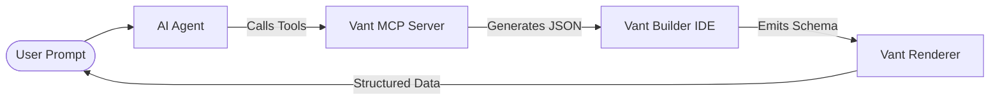

# 🤖 Vant Flow: MCP (Model Context Protocol) Specification

This document outlines the architecture for the `@vant-flow/mcp` package. It positions Vant Flow as the **Standard Structured Interface Layer** for AI Agents, allowing them to scaffold, manipulate, and simulate banking-grade workflows using natural language.

---

## 🌟 The Vision: "Agentic UI"
In the current era, AI can reason but cannot easily "build" compliant, secure interfaces. The Vant MCP acts as the **Hands of the AI**, allowing it to drive the Vant Builder and Renderer with 100% architectural precision.

### Key Advantages:
1.  **Zero-Latency Prototyping**: Go from a 50-page RBZ Directive PDF to a working multi-step form in seconds.
2.  **Architectural Integrity**: The MCP tools enforce Vant's strict `DocumentModel` schema, ensuring the AI never generates "hallucinated" or broken UI code.
3.  **Sandboxed Logic**: AI generates the Client Scripts, but Vant's Proxy-Sandbox ensures they remain secure.
4.  **Simulation & QA**: Agents can "Pre-fill" and "Stress-test" their own forms before showing them to a human.

---

## 🛠️ How it Works: The Bridge
The MCP server exposes Vant’s internal building blocks as **Tools** that any LLM (Claude, GPT, Gemini) can call.



---

## 🧰 The Vant MCP Toolset (Complete API)

The following tools will be available to an AI Agent connected via MCP:

### 1. Structure & Layout Tools
*   `scaffold_from_prompt(context)`: Generates a full `DocumentModel` based on a description (e.g., "A KYC form for SME owners").
*   `add_form_section(label, step_id?)`: Appends a new section.
*   `configure_stepper(enabled, steps[])`: Sets up the multi-step flow configuration.
*   `set_form_settings(settings)`: Configures Submit/Save labels, Intro banners, and global validation flags.

### 2. Field Manipulation Tools
*   `add_field(section_id, props)`: Adds a field (Data, Table, Attach, etc.) with all properties (`mandatory`, `depends_on`, `regex`).
*   `add_table_column(table_fieldname, col_props)`: Specifically handles high-density table column configurations.
*   `update_field_property(fieldname, key, value)`: Precisely patches an existing field (e.g., "Make the ID field read-only").

### 3. Logic & Scripting Tools
*   `generate_client_script(task)`: The AI writes the JavaScript `frm` logic for the Vant sandbox.
*   `add_visibility_logic(fieldname, expression)`: High-level tool for setting `depends_on` without writing full JS.

### 4. Verification & Mocking Tools
*   `generate_mock_data(schema)`: Returns a valid `formData` object used to pre-fill the form.
*   `run_validation_simulation()`: The Agent "clicks" through its own form to find logic errors or missing mandatory fields.

---

## 🌍 Real-World Implementation: Zimbabwe Banking Scenario

### Scenario: The "Emergency Currency Update"
**Context**: A new currency (ZiG) is introduced. All banking forms must now include a "ZiG Equivalence" calculation and a new mandatory "Exchange Rate Source" attachment.

**The Agent's Workflow (using Vant MCP):**
1.  **Human Prompt**: *"Claude, update our 'Retail Loan' form for the new ZiG currency. Add a calculation field and a mandatory attachment for the gazetted rate."*
2.  **Step 1 (`add_field`)**: Agent calls `add_field` to insert a `Float` field for the exchange rate.
3.  **Step 2 (`add_field`)**: Agent calls `add_field` to insert an `Attach` field.
4.  **Step 3 (`generate_client_script`)**: Agent writes the script:
    ```javascript
    frm.on('zig_amount', (val, frm) => {
       const rate = frm.get_value('conversion_rate');
       frm.set_value('usd_equiv', val / rate);
    });
    ```
5.  **Step 4 (`run_validation_simulation`)**: The Agent mocks a submission to verify the calculation works.
6.  **Final Result**: The Human Admin just sees a "Version 2.0" draft ready for approval.

---

## 💼 Hierarchical Holdings Scenario
**Scenario**: Group Procurement requires that any invoice over $10,000 must show an "Extra Verification" section.

**Agent Actions via MCP:**
-   Agent uses `add_form_section` called "High Value Verification".
-   Agent sets `section_depends_on` to `doc.total_invoice_amount > 10000`.
-   Agent inserts a `Signature` field for the Group CEO in that section.

---

## 🚀 Final Goal: "The Self-Building Library"
By integrating this MCP, **Vant Flow** becomes the only library where:
-   **Humans** build via the visual Drag-and-Drop.
-   **AI** builds via the MCP Protocol.
-   **Both** share the exact same underlying architecture, making the transition seamless.

This is the ultimate evolution of the project: **A Modern Form Framework that is natively "Agent-Aware."**
